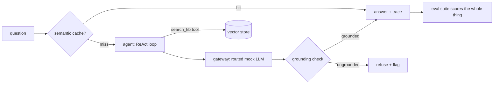

# 🏆 Capstone: DeskMate — A Support-Desk Agentic RAG Pipeline

Build (or study, extend, and break) **DeskMate**: a support-desk assistant that
answers customer questions from a knowledge base, using every module of this course
in one system — and *proves* it works with an eval suite and traces, not vibes.



## What DeskMate Must Do
1. **Index** the knowledge base: sentence-aware chunks → embeddings → vector store
   with source metadata (Module 2).
2. **Retrieve** with top-k semantic search; the agent decides *when* to search and
   with what query (Modules 4–5).
3. **Answer through a gateway** that routes to a mock model tier and meters cost
   per request (Module 8).
4. **Cache** answers semantically with TTL; invalidate by source when a document
   changes (Module 8).
5. **Check grounding** before answering: numbers not present in retrieved context
   mean refuse-and-flag, never ship (Module 7).
6. **Trace** every request: spans for cache lookup, retrieval, model call, checks —
   with token and cost attributes (Module 8).
7. **Pass the eval suite**: labeled Q→A cases scored on grounding, correctness
   (rubric judge), latency, and cost — printed as one honest table (Modules 3 + 7).

## The Reference Implementation
`deskmate/` is a complete working reference — run it:

```bash
python3 -m deskmate.main        # from this capstone/ directory
```

| File | Applies |
|------|---------|
| `deskmate/primitives.py` | Module 1 — tokens, embeddings, similarity |
| `deskmate/knowledge.py` | Module 2 — chunking + vector store |
| `deskmate/agent.py` | Modules 4–5 — tool registry + guarded ReAct loop |
| `deskmate/production.py` | Module 8 — gateway, semantic cache, tracer |
| `deskmate/evals.py` | Modules 3 + 7 — grounding, rubric judge, suite |
| `deskmate/main.py` | The wiring + the demo + the eval table |

## Your Build (choose an order, do them all)
1. **Re-implement before reading.** Delete a file, rebuild it from its module, diff.
2. **Break it, watch the evals catch it.** Change the mock model to fabricate an ETA;
   the grounding gate must convert that case to a refusal, and the suite table must
   show it. If nothing catches your sabotage, the sabotage is your next bug report.
3. **Extend it.** Pick two:
   - Hybrid retrieval with RRF (Module 3) instead of vector-only, and show the
     eval delta.
   - A second specialist agent (billing vs. technical) behind an orchestrator with
     PII-redacted briefings (Module 6).
   - MCP-style tool discovery so the agent finds `search_kb` at runtime (Module 6).
   - Conversation memory with pinned facts across multi-turn sessions (Module 7).

## Definition of Done
- `python3 -m deskmate.main` exits 0: demo answers correct, all suite checks pass.
- The eval table prints grounded-rate, judge score, cache hit rate, total cost —
  and you can explain every number in it.
- One paragraph, written by you: which trade-off (cost/accuracy/latency) your
  extension moved, with the before/after numbers. That paragraph — measured claims
  about an AI system — is the skill this course exists to teach. Live demo it,
  take the structured feedback, and *don't* title the retro "Lessons Learned"
  unless you plan to apply them.
