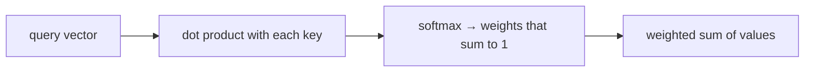

# Module 1: LLM Foundations — Tokens, Vectors, Attention, Prompts

## Learning Objectives
- Explain what a **token** is, why models bill and truncate by tokens, and estimate
  token counts for a piece of text.
- Represent text as **vectors (embeddings)** and measure semantic closeness with
  **cosine similarity** — the primitive under every vector database.
- Demystify **attention**: implement it as a softmax-weighted lookup and see why
  "context" is literally what the model attends to.
- Structure prompts deliberately — role, instructions, context, examples, output
  format — instead of concatenating strings and hoping.
- Decide between **prompting and fine-tuning** with an engineering rubric, not vibes.

---

## 1. Tokens: The Unit of Everything

LLMs never see words. Text is split into **tokens** (subword pieces) by a tokenizer;
the model consumes and produces token IDs. Every hard limit you will ever hit —
context window, pricing, latency, truncation — is denominated in tokens.

| Fact | Engineering consequence |
|------|------------------------|
| ~4 characters ≈ 1 token in English | Estimate budget as `len(text) / 4` before calling |
| Pricing is per input + output token | Long prompts cost money *on every call* |
| Context windows are token-bounded | Retrieval (Module 2+) exists to spend tokens well |
| Rare words split into many tokens | Domain jargon inflates budgets and confuses models |

> **Pitfall:** counting characters or words to check "will this fit?" fails exactly
> when it matters — code, URLs, and non-English text have very different token/char
> ratios. Estimate with a tokenizer (or a calibrated heuristic), never with `len()`.

## 2. Embeddings: Meaning as Geometry

An **embedding** maps text to a fixed-length vector such that *semantically similar
texts land near each other*. Similarity is measured with **cosine similarity** — the
angle between vectors, ignoring length:

```
cos(a, b) = (a · b) / (|a| · |b|)          # 1.0 = same direction, 0 = unrelated
```

This one function powers vector databases, semantic caches (Module 8), memory
(Module 7), and RAG (Modules 2–4). In this course we use deterministic hash-based
embeddings — the geometry and the engineering are identical to production; only the
quality of "meaning" differs.

## 3. Attention: Context Is a Weighted Lookup

Attention answers: *for this query, how much should each piece of context contribute?*
Mechanically it is three steps — score, normalize, blend:



That is the whole trick. Two consequences you will exploit all course:
- **Everything in context competes for weight.** Irrelevant context doesn't just waste
  tokens — it dilutes attention over the relevant parts ("context rot", Module 7).
- **The model can only attend to what you put in front of it.** RAG is attention's
  supply chain.

## 4. Prompting as Engineering

A production prompt is a structured document, not a sentence:

| Section | Purpose | Example |
|---------|---------|---------|
| Role | Set persona and stakes | "You are a support engineer for AcmeDB." |
| Instructions | The task, constraints, refusal rules | "Answer only from the provided context." |
| Context | Retrieved documents, state | "[doc 1] … [doc 2] …" |
| Examples (few-shot) | Show, don't tell, the format | Q/A pairs |
| Output format | Machine-parseable contract | "Reply as JSON: {answer, sources}" |

Few-shot examples are the cheapest capability upgrade that exists: you are steering
the model's pattern-completion with in-context evidence.

> **Pitfall:** instructions buried mid-context get less attention than instructions at
> the start or end. Put the contract where the model will weight it.

## 5. Prompt or Fine-Tune?

The meme says *"Fine-tune nothing, prompt everything"* — and as a default it is
right, but for a reason you should be able to defend:

| Situation | Reach for |
|-----------|-----------|
| Model lacks *knowledge* (your docs, fresh data) | **RAG** — fine-tuning is a terrible database |
| Model lacks *format/style/tone* consistency | Prompting first; fine-tune if examples don't stick |
| Need lower latency/cost at huge volume, fixed task | Fine-tune a smaller model on the big model's outputs |
| Task changes weekly | Prompting — fine-tunes are frozen the day they finish |

Fine-tuning changes *behavior*, not *knowledge*. If the answer isn't in the weights or
the context, no amount of tuning makes it appear — that's a hallucination factory
(Module 8 measures those).

---

## Key Takeaways
- Tokens are the currency: budget, price, and truncate in tokens, never characters.
- Cosine similarity over embeddings is the primitive under RAG, caching, and memory.
- Attention = softmax-weighted lookup; context quality *is* answer quality.
- Prompts are structured documents with a contract, not clever sentences.
- Default to prompting + retrieval; fine-tune for behavior at scale, never for facts.

Next: [Module 2 — RAG Fundamentals](../module_02_rag_fundamentals/README.md).

---

## Files in This Module
- `concepts.py` — tokenizer, embeddings, cosine similarity, attention, prompt assembly
- `exercise.py` — implement the similarity/attention/prompt primitives yourself
- `solution.py` — reference solution
