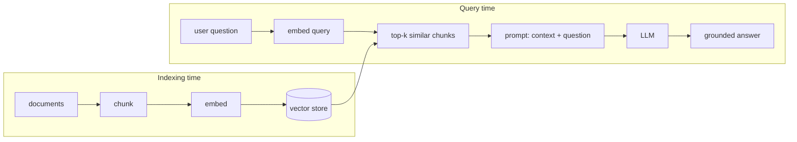

# Module 2: RAG Fundamentals — Chunking, Embeddings, and Your First Vector Database

## Learning Objectives
- State precisely what **RAG** (Retrieval-Augmented Generation) is — and recognize
  what is *not* RAG, no matter what the slide deck says.
- Choose a **chunking strategy** (fixed-size, sentence-aware, overlapping) and explain
  the recall/precision trade-off each one makes.
- Build an embedding **indexing pipeline**: chunk → embed → store with metadata.
- Implement a **vector database** core: an index supporting top-k cosine-similarity
  search — and understand what production stores add on top.
- Feel *why* the vector store earns its place, by watching keyword search fail first.

---

## 1. What RAG Actually Is

RAG is a two-phase architecture:



The model never "learns" your documents. Every answer is generated fresh from
whatever chunks retrieval put in the context window. Consequences:
- **Retrieval quality is an upper bound on answer quality.** The generator cannot
  cite what it never saw.
- Updating knowledge = re-indexing a document. No training, no deployment.
- "We added search to the product" is not RAG unless retrieved text is *fed to a
  generator as context*. (The meme's rule 3 exists for a reason.)

## 2. Chunking: The Most Underrated Decision in RAG

Embeddings represent one chunk with one vector. Too big, and the vector is a blurry
average of many topics; too small, and the chunk lacks the context to be useful.

| Strategy | How | Strength | Weakness |
|----------|-----|----------|----------|
| Fixed-size | Every N tokens | Trivial, uniform budgets | Cuts sentences/ideas mid-stream |
| Sentence-aware | Split on sentence boundaries, pack to ~N | Coherent units | Uneven sizes |
| Overlapping | Fixed/sentence + N-token overlap | Ideas near borders survive | Duplicated storage, near-duplicate hits |
| Structural | Split on headings/paragraphs | Matches author's semantics | Needs clean documents |

> **Pitfall:** a chunk that *embeds* well and a chunk that *reads* well to the LLM are
> different constraints. Retrieval wants small focused chunks; generation wants enough
> surrounding context. Common fix: **retrieve small, expand to the parent chunk**
> before prompting.

## 3. The Indexing Pipeline

Each stored record carries the vector *and* the payload + metadata:

```python
{"id": 17, "vector": [...], "text": "...", "meta": {"source": "handbook.md", "section": "refunds"}}
```

Metadata is not decoration — it powers filtering ("only docs for plan=pro"),
citations, and re-indexing (delete by `source`, re-add). Losing the text→vector
linkage is the classic junior mistake: a vector alone is write-only memory.

## 4. A Vector Database Is Top-K Search Plus Discipline

The core is embarrassingly small: score the query vector against every stored vector,
return the k best. That's a *brute-force (exact) search* — correct and O(N), fine for
thousands of chunks. Production stores (FAISS, pgvector, Pinecone, …) add:

| Layer | What it buys |
|-------|--------------|
| ANN indexes (HNSW, IVF) | Sub-linear approximate search at millions of vectors |
| Metadata filtering | `where source = "handbook"` before/with vector search |
| Persistence, replication | It's a database — durability and scale |
| Hybrid scoring | Vectors + keywords (you'll build this in Module 3) |

The meme's rule 6 — *"add a vector database before you have any vectors"* — inverted,
becomes the engineering rule: **exact search over a list is the right vector database
until measured latency says otherwise.**

## 5. Why Not Just Keyword Search?

Keyword search matches *strings*; embeddings match *meaning*. "How do I get my money
back?" contains zero words from "Refunds are processed within 5 business days" — a
keyword index scores it 0, an embedding index ranks it top-1. You will reproduce this
failure in `concepts.py`, then fix it with the vector store. (Keyword search still
wins on exact identifiers — Module 3 combines both.)

---

## Key Takeaways
- RAG = retrieve relevant chunks, then generate *from them*; retrieval caps quality.
- Chunking sets the resolution of retrieval; overlapping/sentence-aware are sane
  defaults, and "retrieve small, expand big" resolves the embed-vs-read tension.
- Store vector + text + metadata together; metadata drives filters and citations.
- A vector DB core is top-k cosine search; earn ANN indexes with measured latency.
- Semantic search complements keyword search; it does not replace it.

Next: [Module 3 — Advanced RAG](../module_03_advanced_rag/README.md).

---

## Files in This Module
- `concepts.py` — chunkers, indexing pipeline, a working in-memory vector database
- `exercise.py` — build `VectorStore` and an overlapping chunker yourself
- `solution.py` — reference solution
