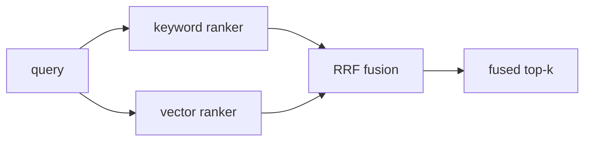

# Module 3: Advanced RAG — Hybrid Search, Query Rewriting, Reranking, Evals

## Learning Objectives
- Explain **why naive RAG plateaus**: vocabulary mismatch, exact-identifier misses,
  and the bi-encoder's blind spot.
- Build **hybrid search**: BM25-style keyword scoring fused with vector search via
  **Reciprocal Rank Fusion (RRF)**.
- Apply **query rewriting** — multi-query expansion and **HyDE** (Hypothetical
  Document Embeddings) — to close the question↔document vocabulary gap.
- Add a **cross-encoder-style reranker** as a second, more precise scoring stage.
- Measure retrieval with **recall@k, precision@k, and MRR** — the evals that tell you
  whether any of the above actually helped.

---

## 1. Why Naive RAG Hits a Ceiling

Module 2's pipeline (embed query → top-k) fails in three systematic ways:

| Failure | Example | Cause |
|---------|---------|-------|
| Exact-identifier miss | "error E-1234" retrieves nothing useful | Embeddings blur rare literal strings |
| Vocabulary gap | "get my money back" vs "refund policy" | Questions and documents use different words |
| Bi-encoder blindness | Top-1 is topically close but doesn't answer | Query and doc embedded *separately* — no interaction between their words |

Each fix below targets one failure. Advanced RAG is not a pile of tricks; it is a
diagnosis-driven checklist.

## 2. Hybrid Search: Keywords + Vectors + RRF

Keyword scoring (BM25 family) is unbeatable on identifiers, names, and codes; vectors
are unbeatable on paraphrase. Run **both**, then fuse rankings with RRF:

```
RRF(doc) = Σ over rankers  1 / (k + rank_of_doc_in_ranker)      # k ≈ 60
```

RRF fuses *ranks*, not scores — so you never have to normalize a cosine similarity
against a BM25 score (they live on incomparable scales; averaging them is a classic
bug).



## 3. Query Rewriting

The user's question is often the *worst* query for finding the answer.

| Technique | Idea | Fixes |
|-----------|------|-------|
| **Multi-query** | LLM generates 3–5 paraphrases; retrieve with all; union results | One phrasing missing the target chunk |
| **HyDE** | LLM writes a *hypothetical answer*, embed THAT as the query | Questions and answers live in different embedding regions — a fake answer lands nearer the real one |
| Decomposition | Split multi-part questions into sub-queries | Compound questions diluting one embedding |

> **Pitfall:** every rewrite is an extra LLM call — latency and cost. Rewrite when
> retrieval evals say recall is the bottleneck, not by default.

## 4. Reranking: Retrieve Cheap, Rank Expensive

A **bi-encoder** (Module 2) embeds query and document independently — fast, cacheable,
but it can't notice that the doc answers *this* query. A **cross-encoder** reads the
query and document *together* and scores their interaction — far more accurate, far
too slow to run against the whole corpus. So: two stages.

```
stage 1 (bi-encoder):    corpus (thousands)  → top-20 candidates      cheap
stage 2 (cross-encoder): 20 candidates       → top-3, reordered       expensive but tiny N
```

This retrieve-then-rerank shape appears everywhere in production RAG.

## 5. Retrieval Evals: recall@k, precision@k, MRR

You cannot claim any of the above helped without a labeled set: `{question →
relevant chunk ids}`. Then:

| Metric | Question it answers |
|--------|--------------------|
| **recall@k** | Of the relevant chunks, what fraction made the top-k? (Can the generator even see the answer?) |
| **precision@k** | Of the top-k, what fraction is relevant? (How much junk dilutes the context?) |
| **MRR** | How high does the *first* relevant chunk rank? (1/rank, averaged) |

Recall@k is the metric to watch first: if the answer isn't retrieved, nothing
downstream can save you. And per the meme's rule 14 — report the whole table, not the
one metric you win.

---

## Key Takeaways
- Naive RAG's failures are systematic: identifiers, vocabulary gaps, bi-encoder blindness.
- Hybrid = keyword + vector rankers fused by RRF over *ranks*, never raw scores.
- Multi-query and HyDE reshape the query to land nearer the answer's embedding.
- Rerank a small candidate set with an expensive scorer; never cross-encode the corpus.
- recall@k / precision@k / MRR on a labeled set decide what actually helped.

Next: [Module 4 — RAG Architectures](../module_04_rag_architectures/README.md).

---

## Files in This Module
- `concepts.py` — BM25-lite, RRF fusion, multi-query + HyDE simulation, reranking, eval metrics
- `exercise.py` — implement RRF, rerank, and recall@k/MRR yourself
- `solution.py` — reference solution
