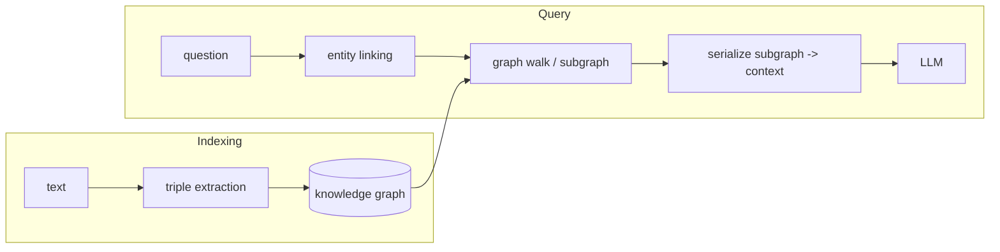

# Module 4: RAG Architectures — GraphRAG, Agentic RAG, Multimodal, and Choosing

## Learning Objectives
- Recognize the **pitfalls of flat vector RAG** that no amount of Module 3 tuning
  fixes: multi-hop questions, aggregations, and relationship queries.
- Build a **GraphRAG** core: extract entities and relations into a knowledge graph,
  answer multi-hop questions by traversal.
- Build **Agentic RAG**: a retrieval loop where the model *decides* whether to
  retrieve, with what query, and whether the evidence is sufficient.
- Understand where **multimodal RAG** changes the pipeline (embedding space and
  chunking) and where it doesn't (everything else).
- Apply a **decision framework**: match the architecture to the question shape, not
  to the conference talk.

---

## 1. Where Flat Vector RAG Fails Structurally

Similarity search retrieves chunks that *look like the question*. Some questions are
not answered by any single chunk:

| Question shape | Example | Why top-k fails |
|----------------|---------|-----------------|
| Multi-hop | "Who manages the engineer who fixed E-1234?" | The answer spans two facts in two chunks; neither resembles the question |
| Aggregation | "How many services depend on the gateway?" | Counting requires *all* matching chunks, not the k nearest |
| Relationship | "What connects team Atlas to the billing outage?" | The *edge* is the answer; chunks store nodes |

These are Module 3-proof: better fusion or reranking still retrieves *similar text*,
and similarity was the wrong tool.

## 2. GraphRAG: Retrieval over Structure

GraphRAG runs extraction at indexing time — an LLM (here: scripted) pulls
`(subject, relation, object)` triples from text into a **knowledge graph**. At query
time you resolve entities in the question, then **traverse edges** instead of
comparing vectors:



Multi-hop becomes a two-edge walk; aggregation becomes counting edges. The cost:
extraction is expensive, entity resolution is fragile ("MegaBank" vs "Mega Bank"),
and the graph is only as good as the extractor. KAG (Knowledge-Augmented Generation)
pushes further in the same direction: schema-constrained graphs + logic-guided
reasoning over them, for domains (medicine, law) where hops must be *provably* right.

## 3. Agentic RAG: Retrieval as a Decision

Classic RAG retrieves once, unconditionally, with the raw question. Agentic RAG puts
retrieval inside a loop the model controls:

```
loop (bounded):
    the model inspects the question + evidence so far, then CHOOSES:
      - retrieve(new query)   <- it may rewrite the query itself
      - answer(text)          <- only when evidence is sufficient
      - refuse                <- when evidence can't be found
```

This buys: on-demand retrieval (skip it for "hello"), iterative refinement (the
second query is informed by what the first found), and self-checking sufficiency.
It costs: an LLM call *per step* and a new failure mode — loops (Module 5 builds the
guards). Agentic RAG is a preview of agents, scoped to one tool.

## 4. Multimodal RAG

Images, tables, and audio enter the same architecture at exactly two points:
1. **Chunking** — a figure or table is its own chunk (never OCR-mangled into prose).
2. **Embedding** — a shared text↔image embedding space (CLIP-style) so "the chart
   with the revenue spike" lands near the actual chart.

Retrieval, fusion, reranking, evals: unchanged. If your documents are slide decks
and dashboards, this is not optional — text-only indexing silently drops the answers.

## 5. Choosing: A Decision Framework

| If your questions are mostly… | Reach for | Because |
|-------------------------------|-----------|---------|
| "Find the passage about X" | Flat RAG + Module 3 | Similarity is the right tool |
| Multi-hop / relational / counting | GraphRAG (or KAG if hops must be provable) | Structure answers structure |
| Unpredictable, mixed, needing follow-ups | Agentic RAG | The model picks the strategy per question |
| About figures/tables/screens | Multimodal RAG | The answers aren't text |

Start flat. Add structure when your **eval failures** (Module 3) show multi-hop or
aggregation misses — the architecture is earned by measured failure, never by fashion.
(That's the meme's rule 3 fixed: not everything is RAG, and not every RAG is flat.)

---

## Key Takeaways
- Flat RAG fails structurally on multi-hop, aggregation, and relationship questions.
- GraphRAG trades expensive extraction for cheap, correct traversal at query time.
- Agentic RAG makes retrieval conditional, iterative, and self-checked — at loop cost.
- Multimodal RAG changes chunking and the embedding space; the rest of the pipeline
  survives intact.
- Choose by question shape and eval evidence; upgrade architectures only on measured
  failure.

Next: [Module 5 — Single-Agent Systems](../module_05_single_agent/README.md).

---

## Files in This Module
- `concepts.py` — triple extraction, graph traversal beating flat RAG, an agentic retrieval loop
- `exercise.py` — build the knowledge graph and the agentic loop yourself
- `solution.py` — reference solution
