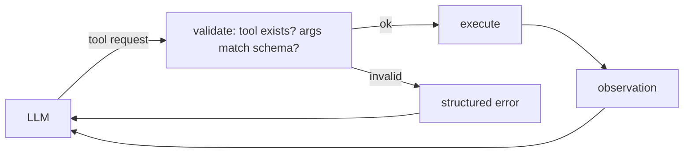

# Module 5: Single-Agent Systems — Tool Calling, ReAct, and Failure Modes

## Learning Objectives
- Define an **agent** precisely enough to know when a chatbot is not one (the meme's
  rule 4 is a real epidemic).
- Implement **tool/function calling**: schema declaration, argument validation, safe
  dispatch, and result feedback.
- Build the **ReAct loop** (Reason → Act → Observe) with a bounded step budget.
- Name the **failure modes of single agents** — infinite loops, hallucinated tools,
  malformed arguments, ignored observations — and implement the guard for each.
- Know what frameworks like Pydantic AI actually provide, so you can evaluate rather
  than worship them.

---

## 1. What an Agent Is (and Isn't)

> **An agent is an LLM that decides, in a loop, which actions to take next —
> using tools, observing results, and iterating until it judges the task done.**

The load-bearing words are *decides*, *loop*, and *observes*:

| System | Loop? | Model picks actions? | Verdict |
|--------|-------|----------------------|---------|
| Chatbot answering from context | no | no | not an agent |
| One-shot "call the weather API, then answer" chain | no | no (you hardcoded it) | pipeline, not agent |
| RAG with fixed retrieve-then-generate | no | no | pipeline |
| Model choosing tools per step until done | yes | yes | agent |

Calling every chatbot an agent isn't just marketing — it makes teams pay agent costs
(loops, unpredictability, eval difficulty) for chatbot problems.

## 2. Tool Calling: A Contract, Not Magic

The model never executes anything. It emits a *request* — `{"tool": name, "args":
{...}}` — and your runtime does the dangerous part. That makes the runtime a
boundary with real responsibilities:



1. **Declare** each tool with a schema (name, typed parameters, description — the
   description is prompt engineering: the model chooses tools by reading it).
2. **Validate** every request: unknown tool names and malformed arguments are
   *expected model behavior*, not exceptional.
3. **Return errors as observations.** A validation failure fed back as text lets the
   model correct itself; a raised exception kills the loop.

This is exactly the niche Pydantic AI fills in production Python: schemas from type
hints, automatic validation, retries on bad arguments. After building it by hand
here, you'll know precisely what you're outsourcing.

## 3. The ReAct Pattern

ReAct interleaves explicit reasoning with actions — the model *says why* before it
acts, and every result comes back as an observation:

```
Thought:      the user wants the invoice total for March
Action:       lookup_invoice {"month": "2026-03"}
Observation:  {"total": 4200, "status": "paid"}
Thought:      I have the total; I can answer now
Final Answer: your March invoice totaled $4,200 (paid).
```

The Thought line is not decoration: it forces the model to commit to a plan the
runtime can log, eval, and debug. When an agent misbehaves, the trace of
thought/action/observation triples is your stack trace.

## 4. Failure Modes and Their Guards

Single agents fail in stereotyped ways. Every guard below is implemented in
`concepts.py`:

| Failure | Symptom | Guard |
|---------|---------|-------|
| Infinite loop | Same action, same args, forever | Step budget + repeated-action detector |
| Hallucinated tool | Calls `send_email` which doesn't exist | Registry validation → error observation |
| Malformed arguments | `{"month": "March"}` where schema wants `YYYY-MM` | Schema validation → error observation, bounded retries |
| Ignored observation | Tool returned the answer; model re-queries anyway | Loop detector + forced-answer fallback |
| Runaway cost | 40 tool calls for a trivial question | Budget in *calls and tokens*, not wall-clock hope |

The meta-rule: **an agent is a while-loop around an unreliable planner.** Everything
you know about defensive programming applies, with the model as the untrusted input.

---

## Key Takeaways
- Agent = model deciding actions in an observed loop; most "agents" are pipelines.
- Tool calling is a validated contract; the runtime, not the model, executes.
- Feed errors back as observations — self-correction is the cheapest retry.
- ReAct's thoughts are your debuggable trace; log them.
- Budget steps, detect repeats, validate everything: guards are the difference
  between an agent and an outage.

Next: [Module 6 — Multi-Agent Systems & MCP](../module_06_multi_agent/README.md).

---

## Files in This Module
- `concepts.py` — tool registry, validation, a full ReAct loop, every failure mode + guard
- `exercise.py` — build the registry and ReAct loop yourself
- `solution.py` — reference solution
