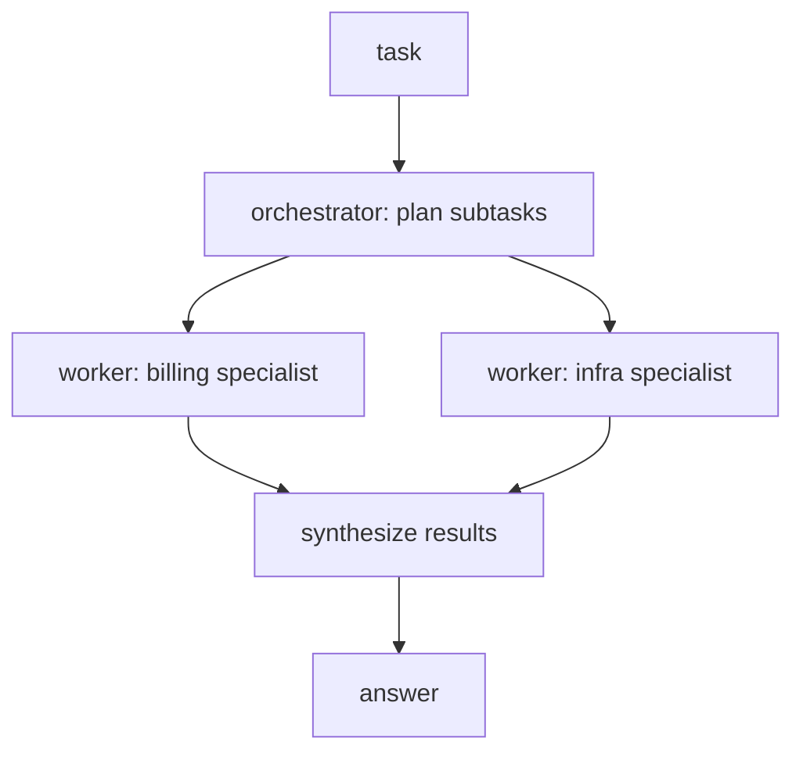

# Module 6: Multi-Agent Systems & MCP — Orchestration, Isolation, Planning

## Learning Objectives
- Know **when multiple agents beat one** — and why the honest answer is "less often
  than the meeting slides say" (the meme's rule 5, taken seriously).
- Build the **orchestrator–worker pattern**: a planner decomposing a task, specialist
  workers with isolated contexts, and result synthesis.
- Explain **information isolation**: why workers get *scoped* context, and what
  breaks (cost, confusion, leakage) when everyone sees everything.
- Implement an **MCP-style protocol**: standardized discovery + invocation of tools
  across servers — and articulate what MCP is *for* (the M×N problem), so you never
  "replace every REST API with MCP whether anyone asked or not."
- Recognize multi-agent-specific failure modes: duplicated work, contradictory
  results, planning drift, and the coordination tax.

---

## 1. One Agent or Many?

Adding agents adds coordination cost — plans, handoffs, synthesis, and N× model
calls. The upgrade is earned only when the task has natural *parallel* or
*specialist* structure:

| Signal | Architecture |
|--------|--------------|
| One tool-loop solves it | **Single agent.** Stop here. Most tasks end here. |
| Independent subtasks, parallelizable (research 5 competitors) | Orchestrator + parallel workers |
| Subtasks need different tools/instructions (SQL analyst vs writer) | Specialist workers |
| Context too big for one window; subtasks each fit | Workers as context partitions |
| Sequential refinement (draft → critique → revise) | Pipeline of 2–3 roles |

"Call every AI agent a multi-agent system" fails engineering review because each
extra agent multiplies cost and adds a *new* class of bug: disagreement between
agents.

## 2. Orchestrator–Worker



The orchestrator does three jobs, each a model call in production:
1. **Plan** — decompose the task into subtasks with an assigned specialist each.
2. **Route** — give each worker *only* the context its subtask needs.
3. **Synthesize** — merge worker reports, detect contradictions, produce the answer.

> **Pitfall:** synthesis is where multi-agent systems quietly fail. Two workers
> return conflicting facts; a naive synthesizer picks one at random. `concepts.py`
> makes the conflict explicit and forces a resolution policy.

## 3. Information Isolation

Give every worker the full conversation and you get: token bills × N, workers
confused by irrelevant instructions, and private context (the user's payment
details) flowing to a worker (the public-web researcher) that must never see it.

Scoping rule: **a worker's context = its subtask + the minimum inputs to do it.**
Isolation is also a *security* boundary — in `concepts.py` the orchestrator redacts
customer PII before briefing the infra worker, and the test proves the worker never
saw it.

## 4. MCP: A Protocol, Not a Fashion Statement

Without a standard, M applications × N tools = M×N bespoke integrations. **MCP
(Model Context Protocol)** makes tools *discoverable and callable in one uniform
shape*, so the cost is M+N:

```
client -> server:  {"method": "tools/list"}
server -> client:  {"tools": [{"name": ..., "description": ..., "inputSchema": ...}]}
client -> server:  {"method": "tools/call", "params": {"name": ..., "arguments": {...}}}
server -> client:  {"content": ...}   or   {"error": ...}
```

The agent runtime speaks this shape once and gains every server's tools — your
Module 5 registry becomes one server among many. When *not* to reach for it: a
fixed pipeline calling one internal API it already knows. A REST endpoint that no
model ever discovers dynamically gains nothing from an MCP wrapper — that's the
meme's rule 2.

## 5. Failure Modes Unique to Multi-Agent

| Failure | Cause | Mitigation |
|---------|-------|------------|
| Duplicated work | Overlapping subtask boundaries | Planner emits disjoint scopes; workers declare coverage |
| Contradictory results | Workers with different context answer differently | Synthesis must *detect* conflicts, not average them |
| Planning drift | Worker reinterprets its subtask | Subtask = instruction + expected output schema |
| Coordination tax | N agents, N× calls, N× latency | Measure against the single-agent baseline (Module 7 evals) |

---

## Key Takeaways
- Multi-agent is an optimization for parallel/specialist structure, not a maturity
  level; single agent is the default.
- Orchestrator = plan, route scoped context, synthesize with conflict detection.
- Isolation cuts cost and confusion — and is a privacy boundary you can test.
- MCP standardizes tool discovery/invocation (M+N, not M×N); wrapping an API nobody
  discovers dynamically is cargo cult.
- Every added agent multiplies cost and adds disagreement as a failure mode.

Next: [Module 7 — Context, Memory & Evals](../module_07_context_memory_evals/README.md).

---

## Files in This Module
- `concepts.py` — orchestrator–worker with isolation + PII redaction, an MCP-style client/server pair
- `exercise.py` — build the MCP server/client and the conflict-detecting synthesizer
- `solution.py` — reference solution
