# Data Platform Mastery — Build an Open-Source ETL Platform on GCP

> **One project. Every concept. Staff-level depth.**
>
> This course fuses two resources into one intensive, hands-on program:
> 1. **[DE System Design Notes](../../DE_interview/SystemDesign/system_design_notes.md)** — the 7-step interview framework, core concepts (partitioning, ingestion patterns, backfill, dedup, contracts, late data), architecture patterns (Lambda/Kappa/Medallion/CDC), and the 20-question interview bank.
> 2. **[GCP Data Engineer Mastery](../gcp_data_engineer_mastery/README.md)** — the GCP service catalog: Cloud Storage, BigQuery, Pub/Sub, Dataflow, Dataproc, Composer, governance, reliability, cost.
>
> Instead of reading about these ideas, **you will build them** — starting from an
> **empty GitHub repository** and ending with **PipeForge**: a real, open-source,
> metadata-driven data platform on GCP that you own, can demo live in interviews,
> and can put at the top of your resume.

---

## What You Will Build: PipeForge

**PipeForge** is an open-source, config-driven ETL/ELT platform. You register a data
source once (a file drop, a database, an API, a Kafka topic) and the platform
generates everything else: the ingestion pipeline, the Airflow DAG, the data-quality
gates, the SCD2 history tables, the reconciliation checks, the audit trail, the
lineage graph, and the entry in the searchable catalog — all visible in a Streamlit
control plane and all provisioned with Terraform.

That is exactly the system asked about in the most common staff-level interview
question — *"Design an ETL framework that can onboard 100 sources without writing
100 pipelines"* (Q7 in the question bank) — except you'll have actually built it.

### Reference architecture

The course follows the same enterprise architecture used by large banks' data
platforms (see the two reference images this course was designed from): sources flow
through a **registration portal** into a **parameter-driven ingestion framework**,
land in a **RAW** zone, and are promoted through **ODP → FDP → CDP** data-product
layers with cross-cutting **DQ, reconciliation, audit, archival, tokenization,
lineage and catalog** services — fronted by APIs and a UI.

```mermaid
flowchart LR
    subgraph SOURCES["SORs / Sources"]
      DB[(OLTP DBs)]
      FILES[File drops<br/>CSV / JSON / Parquet]
      API[REST APIs]
      EVT[Event streams<br/>Kafka]
    end

    subgraph REG["Registration Framework ①"]
      META[(Metadata DB<br/>Cloud SQL Postgres)]
      PORTAL[Streamlit portal + FastAPI]
    end

    subgraph INGEST["Ingestion Framework ② — parameter-driven"]
      BATCH[Batch connectors<br/>file / JDBC / API]
      STREAM[Streaming consumers<br/>Kafka → GCS/BQ]
    end

    subgraph LAKE["GCS Lake + BigQuery"]
      RAW[(RAW / landing<br/>as-is, ingestion-date partitioned)]
      ODP[(ODP — Operational<br/>typed, deduped ≈ Bronze→Silver)]
      FDP[(FDP — Foundation<br/>conformed, SCD2, surrogate keys)]
      CDP[(CDP — Consumption<br/>star schemas, rollups ≈ Gold)]
    end

    subgraph SERVE["Consumption"]
      BI[Looker Studio / BI]
      ML[BigQuery ML / notebooks]
      APPS[Reverse ETL / APIs]
      UI[Streamlit control plane:<br/>catalog · DQ scorecard · ops]
    end

    SOURCES --> INGEST --> RAW --> ODP --> FDP --> CDP --> SERVE
    REG -. drives every pipeline .-> INGEST
    REG -.-> LAKE

    subgraph XCUT["Cross-cutting services"]
      DQ[DQ Framework ④<br/>6 dimensions]
      RECON[Reconciliation ⑦]
      AUDIT[Audit model ⑧<br/>operational metadata]
      TOK[Tokenization ③ DLP/KMS]
      ARCH[Archival & Purge ⑨]
      WF[Workflow ⑩ Airflow]
      CAT[Catalog & Lineage ⑪<br/>Dataplex / OpenLineage]
    end
    XCUT -.applied at every layer.-> LAKE
```

### The 11 platform capabilities (your feature checklist)

These are the numbered capabilities from the reference architecture. Every one of
them is a course phase deliverable — when all 11 are checked, PipeForge is done:

| # | Capability | What it means in PipeForge | Built in |
|---|------------|---------------------------|----------|
| ① | **Data Registration Framework** | Metadata DB + CLI/API/UI to onboard a source in minutes | Phase 2, 11, 12 |
| ② | **Ingestion Framework** — parameter-driven, integrated with the registration portal | One generic engine; N sources = N rows of config, not N pipelines | Phase 3, 4 |
| ③ | **Data anonymization — Tokenization** | Deterministic tokenization of PII with KMS/DLP before data leaves RAW | Phase 9 |
| ④ | **Data Quality Framework — 6 dimensions** | Completeness, accuracy, consistency, timeliness, validity, uniqueness — rules as metadata, gates in every DAG | Phase 8 |
| ⑤ | **Change Data Capture — Type 2** | CDC ingestion + SCD Type-2 history in FDP via Spark/BigQuery MERGE | Phase 5 |
| ⑥ | **Surrogate Key Generation** | Deterministic hash keys + key-mapping tables for dims | Phase 5, 6 |
| ⑦ | **Reconciliation Framework** | Source↔RAW↔ODP↔FDP↔CDP counts/sums/checksums, divergence alerts | Phase 8 |
| ⑧ | **Audit Model — Operational Metadata Capture** | Every run, task, row count, byte count, duration → audit tables | Phase 2, 8, 10 |
| ⑨ | **Data Archival & Purge Framework** | Lifecycle tiers, partition expiry, GDPR right-to-delete | Phase 9 |
| ⑩ | **Workflow** | Airflow DAG **factory** — DAGs generated from metadata | Phase 7 |
| ⑪ | **Catalog Integration** (Collibra-equivalent) | Dataplex catalog + OpenLineage lineage + searchable Streamlit catalog | Phase 9, 11 |

### Final tech stack

| Layer | Technology | Why (always tied to a requirement — the interview habit) |
|---|---|---|
| IaC | **Terraform** | Reproducible envs, reviewable infra, destroy = cost control |
| Landing/lake | **GCS** (+ BigLake/Iceberg) | Cheap replayable raw zone — your backfill insurance policy |
| Warehouse | **BigQuery** | Serving layer for BI/ML; partition+cluster for cost |
| Metadata DB | **Cloud SQL (Postgres)** | OLTP-shaped workload: registry, audit, DQ results |
| Streaming | **Kafka** (local + VM) with a **Pub/Sub** bridge | Learn real Kafka ops *and* the managed-GCP answer |
| Batch/stream processing | **PySpark on Dataproc Serverless** | Distributed transforms, SCD2 MERGE, dedup at scale |
| Orchestration | **Airflow** (local Docker → optional Composer) | DAG factory, backfills, idempotent scheduling |
| Control plane | **FastAPI + Streamlit** on Cloud Run | Registration API + catalog/DQ/ops UI |
| Governance | **DLP, KMS, Dataplex, OpenLineage** | Tokenization, CMEK, catalog, lineage |
| Observability | **Cloud Monitoring + billing export to BQ** | Freshness SLAs, alerting, FinOps dashboard |
| CI/CD | **GitHub Actions** | Tests, lint, terraform plan, container builds |

---

## Who this is for, and the promise

You should already be comfortable with Python and SQL and have skimmed both source
resources at least once. The promise, if you complete every phase honestly:

- **You can crack senior/staff DE system-design interviews.** Every concept in the
  interview notes is something you will have *implemented*, broken, and fixed. You
  won't recite "idempotency"; you'll describe the night your backfill double-counted
  revenue in `fct_orders` and how `MERGE` + partition overwrite fixed it — in *your*
  repo, with the commit to prove it.
- **You own a real open-source project** with releases, docs, CI, an architecture
  README, and a live demo — a resume line that survives any depth of questioning.
- **You are production-fluent on GCP** across storage, compute, streaming,
  orchestration, governance, and cost.

## Course structure

Sixteen units. Each phase = one milestone release of PipeForge (`v0.1.0 → v1.0.0`).
Every phase README follows the same rhythm:

1. **Mission** — what you ship this phase and the git tag you cut.
2. **Concepts** — the theory, cross-referenced to the system-design notes (§) and GCP course modules (M).
3. **Build** — numbered, hands-on steps with real code you commit to *your* repo.
4. **Prove it** — verification checklist (commands + expected output).
5. **Break it** — a deliberate failure drill (staff engineers are made in incidents).
6. **Interview corner** — how to narrate what you just built in an interview, with the exact vocabulary from the notes.
7. **Stretch goals** — optional depth for overachievers.

| Phase | Title | You ship | Tag |
|---|---|---|---|
| [00](phase_00_orientation/README.md) | Orientation & Ground School | GCP project, budgets, tooling, the plan | — |
| [01](phase_01_foundation/README.md) | Empty Repo → Engineering Foundation | Repo, CI, Terraform bootstrap, envs | `v0.1.0` |
| [02](phase_02_metadata_core/README.md) | The Metadata Core (Registration Framework ①⑧) | Cloud SQL registry, data contracts, CLI | `v0.2.0` |
| [03](phase_03_batch_ingestion/README.md) | Batch Ingestion Framework ② | File/JDBC/API connectors → RAW, quarantine, manifests | `v0.3.0` |
| [04](phase_04_streaming_kafka/README.md) | Streaming Ingestion with Kafka ② | Kafka + Schema Registry, consumers → GCS/BQ, DLQ, Pub/Sub bridge | `v0.4.0` |
| [05](phase_05_spark_processing/README.md) | Spark on Dataproc: ODP→FDP (⑤⑥) | Dedup, SCD2, surrogate keys, late data | `v0.5.0` |
| [06](phase_06_bigquery_serving/README.md) | BigQuery Serving: FDP→CDP | Dim/Fact builder, star schema, rollups, cost tuning | `v0.6.0` |
| [07](phase_07_orchestration/README.md) | Orchestration: the DAG Factory ⑩ | Metadata-generated Airflow DAGs, backfill CLI | `v0.7.0` |
| [08](phase_08_data_quality_recon/README.md) | Data Quality & Reconciliation ④⑦ | 6-dimension DQ engine, quarantine, recon framework | `v0.8.0` |
| [09](phase_09_governance/README.md) | Governance: Tokenization, Lineage, Archival, Catalog ③⑨⑪ | DLP tokenization, OpenLineage, purge framework, Dataplex | `v0.9.0` |
| [10](phase_10_observability_finops/README.md) | Observability & FinOps | Freshness SLAs, alerting, cost dashboard | `v0.10.0` |
| [11](phase_11_streamlit_control_plane/README.md) | The Streamlit Control Plane | Catalog search, DQ scorecard, ops console, onboarding wizard | `v0.11.0` |
| [12](phase_12_platform_apis/README.md) | Platform APIs & Multi-Tenancy | FastAPI control plane, Secret Manager, Cloud Run, tenants | `v0.12.0` |
| [13](phase_13_scale_hardening/README.md) | Scale, Hardening & Chaos Drills | 10x load, skew fixes, failure drills, runbooks | `v0.13.0` |
| [14](phase_14_open_source_launch/README.md) | Open-Source Launch & Resume | Docs site, demo mode, release v1.0, resume bullets | `v1.0.0` |
| [🎯](interview_gauntlet/README.md) | The Interview Gauntlet | All 20 question-bank drills answered *with your platform* | — |

Also read **[PROJECT_CHARTER.md](PROJECT_CHARTER.md)** (the full product spec of
PipeForge — treat it like the design doc you'd write at work) and
**[INTERVIEW_MAP.md](INTERVIEW_MAP.md)** (every interview topic → where you built it).

### Suggested pacing

- **Intensive:** 8 weeks full-time (phase ≈ 3–4 days; phases 5, 7, 8 deserve a full week between them).
- **Sustainable:** 16 weeks at ~12 hrs/week — one phase per week, gauntlet drills every weekend from phase 5 onward.

Never move on with a red "Prove it" checklist. The platform is cumulative; debt compounds.

## Cost guardrails (read before touching GCP)

Everything is designed to run on a **few dollars a week** if you follow the rules:

1. **Phase 0 creates a budget alert before anything else.** Non-negotiable.
2. Heavy things are **ephemeral**: Dataproc Serverless (per-second), Kafka on a
   preemptible `e2-small` you stop when idle, Airflow runs **locally in Docker**
   (Composer is an optional one-day excursion — it costs ~$300+/mo if left up).
3. Cloud SQL uses the smallest tier (`db-f1-micro`) and is stopped when idle.
4. Every phase ends with a **Cleanup** section; `terraform destroy -target=...` is a skill, practice it.
5. BigQuery: partition + cluster from day one, and set `maximum_bytes_billed` on every query profile you create.

Typical spend if you're disciplined: **$5–25/month**. The expensive mistakes are
always: idle Composer, idle Cloud SQL at a big tier, an unpartitioned table scanned
by a dashboard, and a forgotten Dataproc *cluster* (which is why we use Serverless).

## Ground rules

1. **Everything is code.** If you clicked it in the console, reproduce it in Terraform before moving on.
2. **Every pipeline is idempotent and backfillable from day one** — parameterized by execution date, partition-overwrite or MERGE writes. This is the single most-tested property in interviews (§7, §13).
3. **Metadata drives everything.** If you find yourself writing a per-source pipeline, stop — add config, not code.
4. **Narrate as you build.** After each phase, do the "Interview corner" out loud with a 45-minute timer. Building without narrating is half the course.
5. **Commit like a professional.** Small commits, meaningful messages, PRs to your own repo with self-review, tagged releases. The repo *is* the resume.
6. **Cost is a requirement**, not an afterthought. Know what every resource costs before you `terraform apply`.

## How the two source resources are woven in

- Each phase's **Concepts** section cites the system-design notes by section number
  (e.g., "§12 Ingestion Patterns", "§18 Deduplication") — reread the cited sections
  *before* the build, then again after. They will read completely differently once
  you've hit the problems they describe.
- Each phase cites GCP course modules (e.g., "M04 BigQuery at Scale") for the
  service-level depth and exam-style tradeoffs. Do those modules' practice questions
  when cited — the PDE cert is a free by-product of this course.
- The **Interview Gauntlet** re-runs the full 20-question bank (Part E of the notes)
  and forces you to answer each one using PipeForge as your evidence base.

Start with **[Phase 00 — Orientation](phase_00_orientation/README.md)**.
