# Google Cloud Professional Data Engineer — Mastery Course

A self-paced, hands-on course that takes you from GCP data fundamentals to a
production-grade, end-to-end data platform — built the way the **Professional Data
Engineer (PDE)** exam expects you to think: pick the *right* service for the
constraint, know the cost/latency/consistency tradeoffs cold, and automate everything
as Infrastructure-as-Code.

By the end you will be able to design, deploy, secure, and operate batch **and**
streaming pipelines on GCP, and answer any "which service and why?" question the exam
throws at you.

## Who This Is For
- Engineers preparing for the **Google Cloud Professional Data Engineer** certification.
- Data / analytics / backend engineers moving onto GCP who want depth, not a tour.
- Anyone who wants to build a real streaming + batch lakehouse with Terraform.

## How Each Module Is Structured

Every module is the same four-file rhythm so you build a habit: **read → study runnable
IaC → do the lab → check the solution.**

| File | Purpose |
|------|---------|
| `README.md` | Learning objectives, deep-dive concepts, **Exam Focus** tradeoff tables, pitfalls, and **Practice Questions** with answers |
| `concepts.tf` (+ `.sql` / `.py`) | Annotated, apply-ready Terraform showing every concept in action |
| `exercise.md` | A lab with numbered TODOs and self-verification checks |
| `solution.tf` (+ `.sql` / `.py`) | Complete reference solution with commentary |

Because this course is **exam-focused**, each README ends with a "🎯 Exam Focus"
decision table and 4–6 practice questions modeled on the real item style.

## The Curriculum

| # | Module | You Will Master |
|---|--------|-----------------|
| 01 | **[Foundations & GCP Data Landscape](module_01_foundations/README.md)** | Projects, IAM, APIs, resource hierarchy, `gcloud`/`bq`/`gsutil`, the exam blueprint, a service-selection mental model, and the open-source ↔ GCP service map (Kafka/HBase/Cassandra/Hive → Pub/Sub/Bigtable/BigQuery) |
| 02 | **[Cloud Storage & Data Lakes](module_02_cloud_storage_data_lake/README.md)** | Storage classes, lifecycle, autoclass, versioning, lakehouse zoning, transfer-tool selection with bandwidth math, and locked-retention archive patterns |
| 03 | **[BigQuery Fundamentals](module_03_bigquery_fundamentals/README.md)** | Datasets, schemas, loading (Avro vs CSV), external/BigLake tables, standard vs legacy SQL, authorized views & Analytics Hub, and BigQuery Omni multi-cloud |
| 04 | **[BigQuery at Scale](module_04_bigquery_at_scale/README.md)** | Partitioning vs sharding (wildcard tables), clustering, slots/reservations for mixed workloads, materialized views, BI Engine, search indexes, and continuous queries |
| 05 | **[Choosing the Right Database](module_05_choosing_a_database/README.md)** | Cloud SQL, Spanner (keys & interleaving), Bigtable (Key Visualizer, SSD/HDD, HBase API), AlloyDB HTAP, Firestore, Memorystore — tradeoffs and a decision tree |
| 06 | **[Streaming Ingestion with Pub/Sub](module_06_pubsub_streaming_ingestion/README.md)** | Topics, subscriptions, ordering, dead-letter + exponential-backoff retry design, exactly-once, schemas, BigQuery/GCS subscriptions, and Kafka bridges |
| 07 | **[Dataflow & Apache Beam](module_07_dataflow_beam/README.md)** | Unified batch/stream, windowing, watermarks, triggers, exactly-once, side outputs & dead-letter handling, debugging DoFn failures, and private/Shared-VPC networking |
| 08 | **[Dataproc & Spark](module_08_dataproc_spark/README.md)** | Ephemeral clusters, Serverless Spark, autoscaling with graceful decommission & EFM, local-SSD tuning, Dataproc Metastore, and Hadoop→GCP migration |
| 09 | **[Orchestration with Cloud Composer](module_09_orchestration_composer/README.md)** | Airflow DAGs, operators (retry/email params), sensors, backfills, idempotency, event-driven triggering, Scheduler vs Workflows vs Composer, and Wrangler/ELT cleansing |
| 10 | **[Governance, Security & Quality](module_10_governance_security/README.md)** | IAM deep-dive (groups!), CMEK/KMS & CMEK-sharing patterns, DLP incl. joinable FPE tokenization, Dataplex data-mesh roles, VPC Service Controls, and lineage |
| 11 | **[ML & Analytics Integration](module_11_ml_analytics/README.md)** | BigQuery ML, Vertex AI, feature pipelines, classic ML theory (feature crosses, wide & deep, embeddings, L1/L2, tuning), and Looker / Looker Studio freshness |
| 12 | **[Reliability, Monitoring & Cost](module_12_reliability_cost/README.md)** | SLOs, Cloud Monitoring, log-based alerting, Ops Agent, budgets/quotas, and CI/CD for data pipelines |
| 13 | **[Migration & Hybrid Connectivity](module_13_migration_hybrid_connectivity/README.md)** | Transfer Appliance & the bandwidth math, Interconnect/VPN, Private Google Access, Datastream private-connectivity CDC, Shared VPC roles, and Kafka/Hadoop estate migration |
| 🏆 | **[Capstone: RideShare Analytics Platform](capstone/README.md)** | A complete streaming + batch lakehouse that applies every module |
| 🎯 | **[Mock Exam](mock_exam/README.md)** | An interactive, browser-based practice exam — 159 original PDE-style questions with instant feedback, explanations, and a per-domain score breakdown (open `mock_exam/index.html`) |

## Prerequisites & Tooling

You need a GCP account with billing enabled. **Everything in this course fits inside the
[Google Cloud Free Tier](https://cloud.google.com/free) or a few dollars of credit** if
you follow the `Cleanup` sections.

```bash
# 1. Install the gcloud CLI (includes bq and gsutil)
#    https://cloud.google.com/sdk/docs/install
gcloud init
gcloud auth login
gcloud auth application-default login   # creds Terraform uses

# 2. Install Terraform >= 1.5
#    https://developer.hashicorp.com/terraform/install
terraform version

# 3. Set your working project once (used throughout the course)
export TF_VAR_project_id="your-gcp-project-id"
export TF_VAR_region="us-central1"
gcloud config set project "$TF_VAR_project_id"

# 4. Enable billing + the base APIs (Module 01 automates the rest)
gcloud services enable serviceusage.googleapis.com cloudresourcemanager.googleapis.com
```

> **Cost guardrail:** create a billing budget with an alert *before* you start
> (Module 12 shows how, but do the manual version now). Always run each module's
> `Cleanup` step — BigQuery storage, Composer, and Dataflow jobs bill continuously.

## Suggested Learning Path

```mermaid
flowchart LR
    A[01 Foundations] --> B[02 Storage]
    B --> C[03 BigQuery]
    C --> D[04 BQ at Scale]
    D --> E[05 Databases]
    E --> F[06 Pub/Sub]
    F --> G[07 Dataflow]
    G --> H[08 Dataproc]
    H --> I[09 Composer]
    I --> J[10 Governance]
    J --> K[11 ML & BI]
    K --> L[12 Reliability & Cost]
    L --> M[13 Migration & Hybrid]
    M --> Z[🏆 Capstone]
```



Storage → analytics → databases forms the **"store"** foundation; Pub/Sub → Dataflow →
Dataproc → Composer forms the **"ingest & process"** spine; governance, ML, and
reliability are the **"secure & operate"** cap.

## Ground Rules (GCP data-engineering best practices)
1. **Right service for the constraint.** Latency, consistency, scale, and cost drive the
   choice — never habit. Learn the decision trees, not just the feature lists.
2. **Serverless first.** Prefer BigQuery, Dataflow, Serverless Spark, and Pub/Sub over
   VMs and self-managed clusters unless a requirement forces otherwise.
3. **Everything is code.** Buckets, datasets, IAM, and jobs are Terraform — reproducible
   and reviewable. Click-ops is for exploration only.
4. **Least privilege, always.** Dedicated service accounts per pipeline; no `Owner` /
   `Editor` on automation; CMEK where data sensitivity demands it.
5. **Design for cost.** Partition and cluster, avoid `SELECT *`, use lifecycle rules and
   autoscaling, and put a budget alert on every project.
6. **Idempotent & observable.** Pipelines you can safely re-run, with monitoring and
   alerting wired in from day one.

Start with **[module_01_foundations](module_01_foundations/README.md)**.
