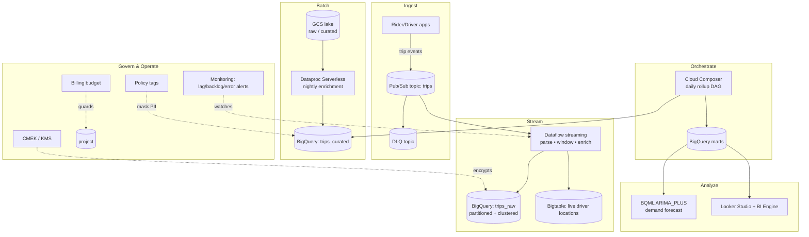

# 🏆 Capstone: RideShare Analytics Platform

## Overview
Build a complete, production-shaped data platform for a ride-share company that ingests
live trip events, processes them in **streaming and batch**, stores them cost-optimally,
governs and secures them, predicts demand with ML, and is fully **monitored** and
**cost-controlled** — all as Terraform + Beam + Airflow + SQL.

This single system exercises **every module** in the course. If you can build and defend
each decision here, you're ready for the exam and for real GCP data engineering.

## Architecture



## Project Structure

```
capstone/
├── README.md
├── terraform/                 # the whole platform as IaC
│   ├── main.tf                # providers, APIs, dedicated service accounts
│   ├── variables.tf
│   ├── storage.tf             # lake buckets (raw/curated), lifecycle, UBLA
│   ├── streaming.tf           # Pub/Sub topic + schema + DLQ + subscriptions
│   ├── bigquery.tf            # datasets + partitioned/clustered tables + MV
│   ├── bigtable.tf            # live driver-location store
│   ├── governance.tf          # KMS/CMEK + policy-tag taxonomy
│   ├── monitoring.tf          # alerts + billing budget
│   └── outputs.tf
├── pipelines/
│   ├── streaming_enrich.py    # Beam: Pub/Sub → windows → BigQuery + Bigtable
│   └── daily_rollup_dag.py    # Airflow: idempotent daily curated → marts + forecast
└── sql/
    ├── schema.sql             # marts DDL, row/column security
    └── ml.sql                 # BQML demand forecast (ARIMA_PLUS)
```

## Concepts Applied Per Module

| Module | Concept | Where in the Capstone |
|--------|---------|-----------------------|
| 1 Foundations | Least-privilege service accounts, APIs | `terraform/main.tf` |
| 2 Cloud Storage | Lake zoning, lifecycle, UBLA | `terraform/storage.tf` |
| 3 BigQuery | Datasets, nested schema, BigLake | `terraform/bigquery.tf`, `sql/schema.sql` |
| 4 BigQuery at scale | Partition + cluster, materialized view | `terraform/bigquery.tf` |
| 5 Databases | Bigtable for live locations (row-key design) | `terraform/bigtable.tf` |
| 6 Pub/Sub | Schema, DLQ, exactly-once, BQ subscription | `terraform/streaming.tf` |
| 7 Dataflow/Beam | Windowed streaming enrichment | `pipelines/streaming_enrich.py` |
| 8 Dataproc | Serverless Spark nightly enrichment | referenced by the DAG |
| 9 Composer | Idempotent daily rollup DAG | `pipelines/daily_rollup_dag.py` |
| 10 Governance | CMEK, policy tags, row-access policy | `terraform/governance.tf`, `sql/schema.sql` |
| 11 ML & BI | ARIMA_PLUS forecast, BI Engine | `sql/ml.sql`, `terraform/bigquery.tf` |
| 12 Reliability/cost | Lag/error alerts, billing budget | `terraform/monitoring.tf` |

## How to Run

```bash
cd terraform

# 1. Configure and provision the platform.
export TF_VAR_project_id="your-project"
export TF_VAR_billing_account="XXXXXX-XXXXXX-XXXXXX"
export TF_VAR_alert_email="you@example.com"
terraform init
terraform apply

# 2. Deploy the streaming pipeline (build a Flex template or run directly).
cd ../pipelines
pip install 'apache-beam[gcp]'
python streaming_enrich.py \
  --runner=DataflowRunner --project=$TF_VAR_project_id --region=us-central1 \
  --streaming --enable_streaming_engine \
  --subscription=projects/$TF_VAR_project_id/subscriptions/trips-dataflow \
  --bq_table=$TF_VAR_project_id:rideshare.trips_raw \
  --temp_location=gs://$TF_VAR_project_id-rideshare-raw/tmp

# 3. Create marts + train the forecast.
bq query --use_legacy_sql=false < ../sql/schema.sql
bq query --use_legacy_sql=false < ../sql/ml.sql

# 4. Deploy the DAG to Composer.
gcloud storage cp daily_rollup_dag.py "$(terraform -chdir=../terraform output -raw dag_gcs_prefix)"

# 5. Publish a test trip event.
gcloud pubsub topics publish trips \
  --message='{"trip_id":"t1","driver_id":"d9","rider_id":"r3","fare_cents":1450,"lat":37.77,"lng":-122.41,"event_ts":1751846400}' \
  --ordering-key=d9
```

## How to Verify

```bash
# Events land in the partitioned raw table:
bq query --use_legacy_sql=false \
  'SELECT COUNT(*) FROM rideshare.trips_raw WHERE DATE(event_ts)=CURRENT_DATE()'
#   → > 0

# Streaming pipeline is healthy (watermark not lagging):
gcloud dataflow jobs list --region=us-central1 --status=active

# Live driver location is queryable in Bigtable:
cbt -project=$TF_VAR_project_id -instance=rideshare-live read driver_locations count=5

# The demand forecast produced 7 future rows:
bq query --use_legacy_sql=false \
  'SELECT COUNT(*) FROM ML.FORECAST(MODEL rideshare_ml.demand, STRUCT(7 AS horizon, 0.8 AS confidence_level))'
#   → 7

# Budget + alerts exist:
gcloud billing budgets list --billing-account="$TF_VAR_billing_account" --format="value(displayName)"
gcloud alpha monitoring policies list --format="value(displayName)"
```

## Readiness / Mastery Checklist
- [x] Streaming ingest with schema validation, DLQ, and exactly-once (Modules 6–7)
- [x] Cost-optimized storage: partitioned + clustered tables, tiered lake (Modules 2, 4)
- [x] Correct store per need: BigQuery analytics + Bigtable low-latency lookups (Module 5)
- [x] Idempotent, backfillable batch orchestration (Modules 8–9)
- [x] Governance: CMEK, column-level policy tags, row-access policy (Module 10)
- [x] ML forecast served to BI with BI Engine acceleration (Module 11)
- [x] Observability + budget guardrails (Module 12)
- [x] Entire platform reproducible as Terraform (Module 1 ground rules)

## Extend It (Stretch)
1. Add **VPC Service Controls** around BigQuery/GCS to block exfiltration.
2. Add a **Vertex AI** endpoint serving the forecast online with a Feature Store.
3. Add **cross-region BigQuery replication** and define RPO/RTO for the platform.
4. Wire the budget's 100% alert to a **Pub/Sub → Cloud Function** that disables billing.

## Cleanup
```bash
cd terraform
terraform destroy   # tears down Pub/Sub, BigQuery, Bigtable, Composer, buckets, etc.
```
