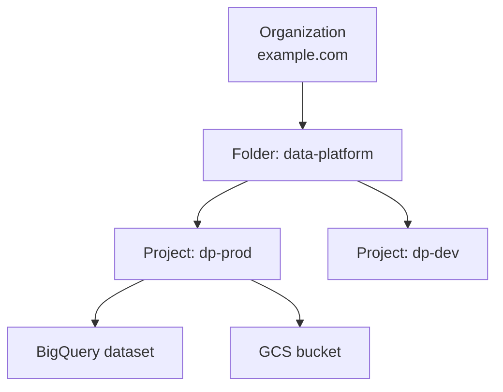
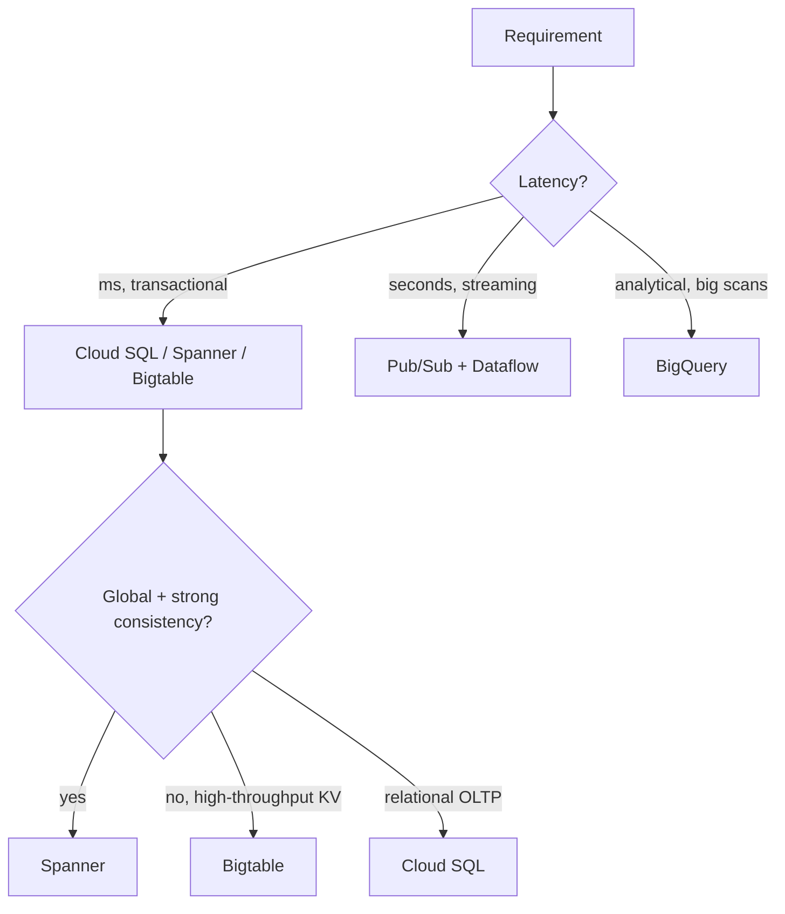

# Module 1: Foundations & the GCP Data Landscape

## Learning Objectives
- Navigate the GCP **resource hierarchy** (Organization → Folder → Project → Resource)
  and know where quotas, billing, and IAM policies attach.
- Distinguish the three IAM principals and role types, and apply **least privilege** with
  service accounts.
- Enable APIs and manage projects with `gcloud`, `bq`, and `gsutil`.
- Map the **PDE exam blueprint** to the five data-engineering domains.
- Apply a **service-selection mental model** you'll reuse in every later module.

---

## 1. The Resource Hierarchy

Every GCP resource lives in a tree. IAM policies and org policies set on a node are
**inherited** by everything beneath it — this is the single most tested governance idea.



| Level | What attaches here | Exam-relevant fact |
|-------|-------------------|--------------------|
| Organization | Org policies, top-level IAM | Root of inheritance; tied to a Cloud Identity/Workspace domain |
| Folder | IAM, org policy overrides | Model departments/environments |
| Project | Billing account, APIs, quotas, IAM | **The unit of billing, isolation, and quota** |
| Resource | Resource-level IAM (e.g. a bucket) | Most granular; adds to inherited policy |

> **Pitfall:** IAM is **additive and union-based** — you cannot *subtract* an inherited
> grant with a lower-level policy (there is no "deny by absence"). To remove access you
> revoke it at the level it was granted, or use an explicit **IAM Deny policy**.

## 2. IAM: Principals, Roles, Bindings

- **Principals (members):** Google accounts, **service accounts**, Google Groups,
  domains, and `allAuthenticatedUsers`/`allUsers`.
- **Roles:** collections of permissions. Three tiers:

| Role type | Examples | Use when |
|-----------|----------|----------|
| **Basic** (primitive) | `roles/owner`, `roles/editor`, `roles/viewer` | Almost never in production — too broad |
| **Predefined** | `roles/bigquery.dataEditor`, `roles/dataflow.worker` | The default choice — least privilege |
| **Custom** | your own permission set | When predefined roles are still too broad |

- **Binding:** `principal → role` on a resource. The policy is the set of bindings.

```hcl
# Grant a pipeline's service account only what it needs — not Editor.
resource "google_project_iam_member" "sa_bq_jobs" {
  project = var.project_id
  role    = "roles/bigquery.jobUser"          # run queries...
  member  = "serviceAccount:${google_service_account.pipeline.email}"
}
```

> **Pitfall:** `google_project_iam_policy` is **authoritative** and overwrites the entire
> project policy — it can lock you out. Prefer `google_project_iam_member` (adds one
> binding) unless you truly own the whole policy.

### Service accounts (SA)
Automation identity. Two things people confuse:
- **Who can *act as* the SA** — `roles/iam.serviceAccountUser` (impersonation / attach).
- **What the SA can *do*** — roles granted *to* the SA on resources.

Prefer **attaching a SA to a service** (Dataflow, Dataproc, Composer) or **short-lived
impersonation** over exporting long-lived JSON keys. Exported keys are the #1 credential
leak on the exam and in real life.

## 3. The CLI Trio

| Tool | Scope | Example |
|------|-------|---------|
| `gcloud` | Everything (projects, IAM, services, compute…) | `gcloud services enable bigquery.googleapis.com` |
| `bq` | BigQuery | `bq query --use_legacy_sql=false 'SELECT 1'` |
| `gsutil` / `gcloud storage` | Cloud Storage | `gcloud storage cp file.csv gs://bucket/` |

```bash
gcloud config set project "$PROJECT_ID"
gcloud projects get-iam-policy "$PROJECT_ID" --format=json   # audit who has what
gcloud services list --enabled                               # which APIs are on
```

## 4. The PDE Exam Blueprint

The exam maps to five domains. This course is organized around them:

| Domain | Weight (approx.) | Covered in |
|--------|------------------|-----------|
| Designing data processing systems | ~22% | 01, 05, all "which service" tables |
| Ingesting & processing the data | ~25% | 06, 07, 08, 09 |
| Storing the data | ~20% | 02, 03, 04, 05 |
| Preparing & using data for analysis | ~15% | 03, 04, 11 |
| Maintaining & automating workloads | ~18% | 09, 10, 12 |

## 5. A Service-Selection Mental Model

For any "which service?" question, filter on these axes **in order**:



Axes: **latency**, **consistency**, **scale/throughput**, **structure** (relational /
KV / document / analytical), **cost model** (serverless vs provisioned), and
**managed-ness**. Memorize these; every later module refines one branch.

---

## 6. Open-Source ↔ GCP Service Map (a real-exam favorite)

Many exam questions describe an **open-source stack** and ask for its GCP landing
zone — or describe requirements that only one OSS tool satisfies. Know both
directions cold:

| Open source | GCP managed counterpart | Nuance the exam tests |
|---|---|---|
| Apache Kafka | **Pub/Sub** (or **Managed Service for Apache Kafka**) | Kafka is the answer when the requirement is *seek to an arbitrary offset / replay all history ever captured* with per-key ordering across hundreds of topics; Pub/Sub replays via retention + seek within its window. Bridge estates with the **Pub/Sub Kafka connector** or Dataflow `KafkaIO` |
| Apache HBase | **Bigtable** | Bigtable exposes an **HBase-compatible API** — near-zero app change |
| Apache Cassandra | **Bigtable** | Same wide-column model; partition-key thinking → row-key design |
| MongoDB | **Firestore** | Document model, serverless scaling |
| HDFS | **Cloud Storage** | The GCS connector makes `gs://` a drop-in for `hdfs://` |
| Apache Hive | **BigQuery** (or Hive on Dataproc) | HiveQL over Parquet/ORC in GCS → BigQuery external/BigLake tables for minimal-ops SQL |
| Apache Spark / Hadoop MR | **Dataproc / Dataproc Serverless** | Lift-and-shift jobs; Serverless removes cluster ops |
| Apache Airflow | **Cloud Composer** | Existing DAGs port with minimal change |
| Apache Beam | **Dataflow** | Beam is the SDK; Dataflow is the managed runner |
| Redis / Memcached | **Memorystore** | Sub-ms cache, rebuildable data |

When a question lists NoSQL candidates (HBase, Cassandra, MongoDB, Redis, Hive),
match on *data model + latency + scale*: wide-column high-write → HBase/Cassandra
(→ Bigtable); document → MongoDB (→ Firestore); in-memory cache → Redis
(→ Memorystore); SQL-on-files → Hive (→ BigQuery).

## 🎯 Exam Focus

| If the question says… | Reach for… | Because |
|-----------------------|-----------|---------|
| "remove one user's access org-wide" | IAM **Deny policy** | Additive model can't subtract via lower policy |
| "third-party needs to run our jobs, no keys" | **SA impersonation** / Workload Identity | Avoids exported JSON keys |
| "isolate cost & quota per team" | Separate **projects** | Project = billing/quota boundary |
| "grant least privilege to run queries but not edit data" | `bigquery.jobUser` + `bigquery.dataViewer` | Split job-run from data-edit |
| "policy must apply to all current & future projects in a dept" | Set IAM on the **Folder** | Inheritance |

### Practice Questions
1. **A team must run BigQuery queries but must not be able to delete tables. Which role
   set?** → `roles/bigquery.jobUser` (run jobs) + `roles/bigquery.dataViewer` (read
   data). `dataEditor`/`dataOwner` would allow deletes.
2. **You granted `roles/storage.admin` at the folder level and now want to remove it for
   one project.** → You cannot "un-inherit." Either revoke at the folder and re-grant
   narrowly, or add an **IAM Deny policy** on that project.
3. **An external partner's app must call your Pub/Sub without long-lived keys.** →
   Configure **Workload Identity Federation** / SA impersonation; never export a key.
4. **Which resource is the unit of billing and quota isolation?** → The **Project**.
5. **`google_project_iam_policy` vs `google_project_iam_member` — which is safe to add a
   single binding in a shared project?** → `_member` (additive). `_policy` is
   authoritative and overwrites everything.

---

## Key Takeaways
- The hierarchy inherits IAM top-down; policy is **additive** — use Deny policies to
  subtract.
- Prefer **predefined roles + dedicated service accounts**; avoid basic roles and
  exported keys.
- The **project** is the isolation, billing, and quota unit.
- Every service choice reduces to latency / consistency / scale / structure / cost.

Next: [Module 2 — Cloud Storage & Data Lakes](../module_02_cloud_storage_data_lake/README.md).

---

## Files in This Module
- `concepts.tf` — enables the data APIs and provisions a least-privilege pipeline SA
- `exercise.md` — stand up a project baseline: APIs, SA, and scoped IAM
- `solution.tf` — reference solution
