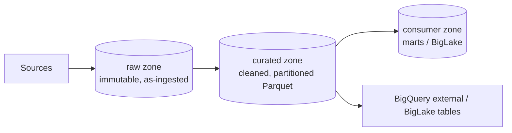

# Module 2: Cloud Storage & Data Lakes

## Learning Objectives
- Choose the right **storage class** (Standard/Nearline/Coldline/Archive) and **location
  type** (region/dual-region/multi-region) for a workload.
- Automate cost with **lifecycle rules**, **Autoclass**, and **object versioning**.
- Design a lakehouse with **raw → curated → consumer** zones.
- Secure buckets with **uniform bucket-level access** and understand signed URLs vs IAM.
- Know when GCS is the answer vs BigQuery/Bigtable.

---

## 1. Storage Classes — the Cost/Access Tradeoff

All classes have the **same throughput and millisecond latency**. They differ only in
**storage price** vs **access cost** and a **minimum storage duration**.

| Class | Best for | Min duration | Rel. storage $ | Rel. access $ |
|-------|----------|--------------|----------------|----------------|
| **Standard** | Hot data, active analytics | none | High | Low |
| **Nearline** | Accessed < once/month | 30 days | Medium | Medium |
| **Coldline** | Accessed < once/quarter | 90 days | Low | High |
| **Archive** | DR, compliance, rarely read | 365 days | Lowest | Highest |

> **Pitfall:** Early deletion / rewrite before the minimum duration still bills you for
> the *full* minimum. Don't put churning data in Coldline/Archive.

## 2. Location Types

| Type | Example | Availability | Cost | Use |
|------|---------|--------------|------|-----|
| Region | `us-central1` | Single region | Lowest | Colocate with Dataflow/Dataproc/BigQuery to avoid egress |
| Dual-region | `nam4` | 2 regions, low RPO | Medium | HA with predictable placement |
| Multi-region | `US`, `EU` | Continent-wide | Highest | Serving to broad audiences |

> **Exam trap:** put your bucket in the **same region as your compute and BigQuery
> dataset**. Cross-region reads add latency **and egress cost**, and BigQuery can only
> load/export within the same location.

## 3. Lifecycle, Autoclass & Versioning

- **Lifecycle rules:** conditions (age, class, versions) → actions (`SetStorageClass`,
  `Delete`, `AbortIncompleteMultipartUpload`).
- **Autoclass:** GCS auto-transitions each object between classes based on access — set
  it and forget lifecycle-class tuning.
- **Object versioning:** keeps overwritten/deleted versions (noncurrent) — combine with a
  lifecycle rule to expire old versions.

```hcl
lifecycle_rule {
  condition { age = 30 }
  action { type = "SetStorageClass"; storage_class = "NEARLINE" }
}
lifecycle_rule {
  condition { age = 365 }
  action { type = "Delete" }
}
```

> **Pitfall:** Autoclass and per-object lifecycle *class* transitions are mutually
> exclusive — use one strategy. You can still keep a `Delete` lifecycle rule with
> Autoclass on.

## 4. Security: Uniform vs Fine-grained, IAM vs ACLs

- **Uniform bucket-level access (UBLA):** disables per-object ACLs; IAM alone controls
  access. **Recommended default** — simpler, auditable.
- **Signed URLs:** time-limited access to a specific object **without** granting IAM —
  perfect for letting an external client upload/download one file.
- **CMEK:** encrypt with your Cloud KMS key for compliance (Module 10).

| Need | Use |
|------|-----|
| Simple, auditable access control | UBLA + IAM |
| Give an outsider temporary access to one object | **Signed URL** |
| Regulatory key control | CMEK |
| Public website assets | `allUsers:objectViewer` (rare, deliberate) |

## 5. The Data Lake / Lakehouse Zoning Pattern



| Zone | Format | Mutability | Who reads |
|------|--------|-----------|-----------|
| **raw** | source-native (JSON/CSV/Avro) | append-only, immutable | pipelines only |
| **curated** | columnar (Parquet/ORC), partitioned | rewritten by ETL | analysts, BigLake |
| **consumer** | marts, aggregates | published | BI, apps |

Query lake files in place with **BigLake tables** (governed external tables) — you get
BigQuery security/metadata over GCS without loading. This is the modern "lakehouse."

---

## 6. Getting Data In: Transfer Options & the Bandwidth Math

A recurring exam item gives you a data volume, a link speed, and a deadline —
**do the math before picking a tool** (time ≈ volume ÷ effective bandwidth; e.g.,
400 TB over 100 Mbps ≈ a year — no software fixes that):

| Scenario | Answer |
|---|---|
| < a few TB, one-off, decent bandwidth | `gcloud storage cp` / `gsutil` (parallel composite uploads for big files) |
| Large, recurring/scheduled transfers; S3, HTTP, or on-prem NAS sources | **Storage Transfer Service** (agent pools for on-prem, incremental sync) |
| Tens of TB–PB over a weak link, or a deadline the math can't meet | **Transfer Appliance** — physical device shipped, loaded locally, ingested by Google |
| Google SaaS (Ads, GA4, YouTube) or S3/Redshift/Teradata → BigQuery | **BigQuery Data Transfer Service** (also loads **from GCS to BigQuery** on a schedule — a no-code path) |
| Continuous database change replication | **Datastream** (CDC — Module 13) |

### Cold, Immutable Archives (compliance pattern)
For data read once or twice a year that must be **immutable for N years** at
minimum cost: **export from BigQuery to Cloud Storage**, set the object class to
**Archive**, apply a **locked retention policy** (WORM — nobody, not even owners,
can delete early), and keep it queryable on the rare occasion you need it via a
**BigQuery external table**. This beats keeping it in BigQuery native storage
(even long-term pricing) and beats snapshots/clones for multi-year immutability.

### Tiering & Multi-Cloud Exposure
BigQuery serves the *active* analytics; a GCS copy (often compressed
Avro/Parquet) serves *file-based consumers* — other clouds, partners, replays.
Same lakehouse thinking as the zoning pattern above: BigQuery is a consumer of
the lake, GCS is the interchange format.

## 🎯 Exam Focus

| Scenario | Answer |
|----------|--------|
| "Data read a few times a year, minimize storage cost" | **Coldline** (Archive only if truly <1/yr) |
| "Bucket + Dataproc + BigQuery, minimize cost/latency" | Put all in the **same region** |
| "Let a partner upload one file, no GCP account" | **Signed URL** (resumable/PUT) |
| "Automatically tier data by access without tuning" | **Autoclass** |
| "Keep deleted objects recoverable for 30 days" | **Versioning** + lifecycle to expire noncurrent >30d |
| "Query files in GCS with BigQuery security/governance" | **BigLake** table |

### Practice Questions
1. **Logs written once, read only for the rare audit within 30 days, then kept 7 years
   for compliance.** → Standard (or Nearline) for first 30 days → lifecycle to **Archive**
   for long-term retention; add a **retention policy/bucket lock** for compliance.
2. **A pipeline in `us-central1` loads a bucket in the `EU` multi-region — why is the load
   failing / expensive?** → BigQuery/Dataflow can't cross locations for loads and you pay
   egress. Colocate the bucket in `us-central1` (or dataset in `EU`).
3. **You need to hand an external analyst read access to exactly one object for 1 hour.**
   → **Signed URL** with 1-hour expiry — not an IAM grant.
4. **Cheapest correct class for data accessed on average once a month.** → **Nearline**.
5. **Best way to enforce that no objects use legacy ACLs.** → Enable **uniform
   bucket-level access**.

---

## Key Takeaways
- Classes trade storage $ for access $ + a minimum-duration penalty — match to access
  frequency.
- **Colocate** bucket, compute, and BigQuery dataset in one region.
- Automate tiering with **Autoclass** or **lifecycle**; protect data with **versioning**
  and retention locks.
- Prefer **UBLA + IAM**; use **signed URLs** for keyless external access; query in place
  with **BigLake**.

Next: [Module 3 — BigQuery Fundamentals](../module_03_bigquery_fundamentals/README.md).

---

## Files in This Module
- `concepts.tf` — a lakehouse-zoned bucket with lifecycle, versioning, and UBLA
- `exercise.md` — build raw/curated buckets with tiering and a retention policy
- `solution.tf` — reference solution
