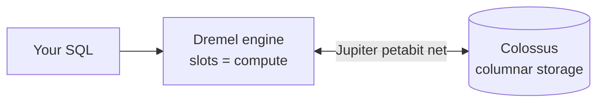

# Module 3: BigQuery Fundamentals

## Learning Objectives
- Model data with **datasets, tables, views**, and nested/repeated (`STRUCT`/`ARRAY`)
  schemas.
- Choose among **native tables, external tables, and BigLake** for a source.
- Load data (batch load, `LOAD DATA`, streaming inserts) and understand each path's cost.
- Write correct **GoogleSQL**, including nested-data unnesting.
- Understand BigQuery's **architecture** (separation of storage & compute) and why it's
  serverless.

---

## 1. Architecture: Why BigQuery Is Different

BigQuery separates **storage** (Colossus) from **compute** (Dremel/slots), connected by
the Jupiter network. You don't provision servers; you submit SQL and BigQuery allocates
**slots**.



| Property | Consequence for you |
|----------|--------------------|
| Columnar storage | `SELECT` only the columns you need — it prunes the rest |
| Storage ≠ compute | Storage is cheap; you pay for **bytes scanned** (on-demand) or **slot-time** |
| Serverless | No cluster to size; scales automatically |

## 2. Datasets, Tables, Views

| Object | What it is |
|--------|-----------|
| **Dataset** | Namespace + **location** (US/EU/region) + default IAM & expiration |
| **Native table** | Data stored in BigQuery's managed columnar format (fastest) |
| **External table** | Schema over data left in GCS/Sheets/Bigtable — no load, no BQ storage cost |
| **BigLake table** | External table **with** fine-grained security + metadata caching |
| **View** | Saved query (logical); **materialized view** = precomputed & auto-maintained |

> **Pitfall:** A dataset's **location is immutable** and every table in it (and every
> query, load, and export) must stay in that location. Choose US/EU/region deliberately.

## 3. Native vs External vs BigLake

| | Native | External | BigLake |
|--|--------|----------|---------|
| Storage cost | BQ storage | none (GCS) | none (GCS) |
| Query speed | Fastest | Slower (no clustering/stats) | Slower, but metadata cache helps |
| Partition/cluster | Yes | Limited (Hive partitioning) | Hive partitioning + caching |
| Fine-grained security | Yes | No | **Yes** (row/column, via BQ) |
| Use when | Hot, frequently queried | Ad-hoc / staging over lake | Governed lakehouse over GCS |

## 4. Loading Data — Paths & Cost

| Path | Cost | Latency | Use |
|------|------|---------|-----|
| **Batch load** (`bq load`, `LOAD DATA`) | **Free** (uses a shared pool) | minutes | Bulk files from GCS |
| **Storage Write API** | Paid, cheap | seconds | High-throughput streaming (preferred) |
| **Legacy `tabledata.insertAll`** | Paid | seconds | Older streaming (avoid for new work) |
| **Query result → table** | Query cost | — | Transform & materialize |

> **Exam trap:** *batch loads from GCS are free*; streaming inserts are **not**. If the
> question emphasizes cost and doesn't require real-time, choose **batch load**.

## 5. GoogleSQL & Nested Data

BigQuery embraces **nested & repeated** fields to avoid joins. Flatten with `UNNEST`.

```sql
-- One row per order, items is an ARRAY<STRUCT>. Explode to line items:
SELECT o.order_id, item.sku, item.qty
FROM orders AS o, UNNEST(o.items) AS item
WHERE o.order_date = CURRENT_DATE();
```

> **Pitfall:** `SELECT *` scans (and bills for) **every column**. Name columns; on
> partitioned tables always add a partition filter.

---

## 6. Exam Deep Dive: Formats, Consistency & Sharing

### File formats for loading
Prefer **Avro** (or Parquet) over CSV/JSON for serious pipelines: self-describing
schema, preserves **nested/repeated** structures, compresses well, and — critically
— compressed Avro/Parquet **load in parallel**. Gzipped CSV/JSON is *not splittable*,
so one file = one reader. "Transform text files to compressed Avro with Dataflow,
land in GCS, load/link to BigQuery" is a canonical pattern.

### Legacy SQL vs GoogleSQL (standard SQL)
Old datasets may contain **legacy SQL views** — these can't be consumed through
modern interfaces (ODBC/JDBC drivers require standard SQL). Fix: **recreate the
view in GoogleSQL** and authenticate tools via a **service account**. On the exam,
"legacy SQL" in a scenario is almost always the thing to migrate away from.

### Streaming-insert visibility vs batch consistency
Streaming rows are queryable within seconds, but an aggregation issued *immediately*
after inserts may miss in-flight rows. If the app **requires read-after-write
consistency for aggregates**, accumulate and use **batch loads** (each load job is
atomic — readers see all of it or none of it) or query with a small delay.

### Large query results → destination tables
Interactive results have size caps and get discarded. For "retrieve a huge result
set and query it further," set a **destination table** on the query job (with
`allow_large_results` semantics) — the result becomes a normal table for follow-on
SQL. Cheap, low-maintenance, no export loop.

### Sharing without copying
- **Authorized views / authorized datasets**: consumers query the view without
  access to base tables — and **query costs bill to the consumer's project**, a
  detail the exam loves ("analysis costs assigned to the requesting team").
- **Analytics Hub**: publish/subscribe dataset sharing across orgs, no copies.

### Multi-cloud: BigQuery Omni + BigLake
Data in **AWS S3 / Azure Blob** can be queried from BigQuery without moving it:
**BigQuery Omni** runs BigQuery compute in the other cloud, and **BigLake tables**
over S3/GCS give governed access (users query tables; they never touch buckets).
"Query up-to-date data across clouds from one SQL surface" → Omni + BigLake.

## 🎯 Exam Focus

| Scenario | Answer |
|----------|--------|
| "Load 500 GB nightly from GCS, minimize cost" | **Batch load** (free) into a native table |
| "Real-time rows, high throughput" | **Storage Write API** |
| "Query lake files with row/column security" | **BigLake** table |
| "Ad-hoc query of a CSV in GCS, don't want to load it" | **External** table |
| "Data must reside in the EU" | Create dataset in the **EU** location; keep buckets in EU |
| "Reduce cost of repeated `SELECT AVG(x)` dashboards" | **Materialized view** (Module 4) |

### Practice Questions
1. **You query a 10-column, 1 TB table but only need 2 columns. Cheapest change?** →
   Select only those 2 columns — columnar storage prunes the rest, cutting bytes scanned.
2. **Compliance requires data stay in Europe. Where do you enforce it?** → Dataset
   **location = EU** (and colocate GCS). Location is immutable — set it at creation.
3. **A source CSV in GCS is queried a few times for exploration; you don't want BQ storage
   cost.** → **External table** (or BigLake if you need governance).
4. **Nightly 800 GB load, cost-sensitive, not time-critical.** → **Batch load** (free) vs
   streaming (paid).
5. **You need row-level security over data physically in GCS.** → **BigLake** table
   (external tables can't do fine-grained security).

---

## Key Takeaways
- BigQuery = **serverless, columnar, storage/compute-separated**; you pay for bytes
  scanned or slot-time.
- Dataset **location is immutable** — choose it up front and colocate storage.
- **Batch loads are free**; streaming costs — pick based on latency need.
- Prefer **native** for hot data, **BigLake** for governed lake access; avoid `SELECT *`.

Next: [Module 4 — BigQuery at Scale](../module_04_bigquery_at_scale/README.md).

---

## Files in This Module
- `concepts.tf` — dataset, native table (nested schema), and a BigLake external table
- `queries.sql` — runnable GoogleSQL: nested unnesting, DDL, load statements
- `exercise.md` — model and load an events dataset
- `solution.tf` / `solution.sql` — reference solution
