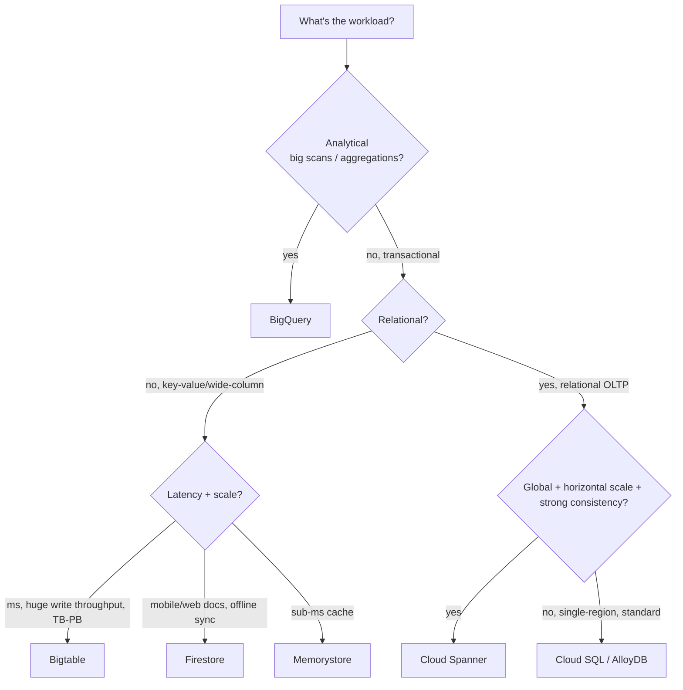

# Module 5: Choosing the Right Database

## Learning Objectives
- Map a workload to the correct GCP data store using **latency, consistency, scale, and
  data shape**.
- Contrast **Cloud SQL, Spanner, Bigtable, Firestore, Memorystore, AlloyDB**, and BigQuery.
- Explain the **CAP/PACELC** tradeoffs each service makes.
- Recognize the exam's favorite "which database?" trigger phrases.
- Provision each with Terraform and know the cost/scaling knobs.

---

## 1. The Decision Tree



## 2. The Services at a Glance

| Service | Model | Consistency | Scale | Latency | Sweet spot |
|---------|-------|-------------|-------|---------|-----------|
| **Cloud SQL** | Relational (MySQL/PG/SQL Server) | Strong, single-region | Vertical (+read replicas) | ms | Classic OLTP apps, <~64 TB |
| **AlloyDB** | PostgreSQL-compatible | Strong | Vertical + read pools; columnar accel | ms | High-perf PG, HTAP |
| **Spanner** | Relational, distributed | **Strong, global** (TrueTime) | **Horizontal, unlimited** | ms | Global OLTP, 99.999% SLA, no sharding |
| **Bigtable** | Wide-column NoSQL (HBase API) | Strong per-row, eventual across clusters | **Horizontal, PB, millions ops/s** | single-digit ms | Time-series, IoT, adtech, high-throughput KV |
| **Firestore** | Document NoSQL | Strong | Auto, horizontal | ms | Mobile/web apps, offline sync, realtime |
| **Memorystore** | Redis/Memcached | — (cache) | Vertical/cluster | **sub-ms** | Caching, leaderboards, sessions |
| **BigQuery** | Columnar analytical | Strong | Serverless, PB | seconds | Analytics, DW, not OLTP |

## 3. Bigtable Deep-Dive (a favorite exam topic)

- **Wide-column**, single **row key** — design it for your access pattern; **no secondary
  indexes**, no joins, no SQL (uses the HBase-style API / limited GoogleSQL).
- Scales linearly with **nodes**; throughput ≈ nodes. Storage is SSD or HDD.
- **Row-key design is everything.** Avoid **hotspotting**: don't use monotonically
  increasing keys (timestamps, sequential IDs) as the prefix — they funnel writes to one
  node. **Field-promote / salt / reverse** the key.

```
BAD row key:  20260707#sensor42        <- time prefix -> write hotspot
GOOD row key: sensor42#20260707        <- field-promote id first -> spreads writes
```

> **Pitfall:** Bigtable has **no ACID multi-row transactions** and no ad-hoc analytics.
> If you need SQL joins → Spanner/Cloud SQL/BigQuery.

## 4. Spanner vs Cloud SQL

| | Cloud SQL | Spanner |
|--|-----------|---------|
| Scale | Vertical (one primary) | Horizontal, add nodes, no re-shard |
| Global writes | No (single region primary) | **Yes**, strongly consistent |
| Consistency tech | Standard MySQL/PG | **TrueTime** atomic clocks |
| SLA | 99.95% | up to **99.999%** |
| Cost | Low | High (pay for the guarantee) |
| Use | Most apps | Global scale + strong consistency needed |

> **Exam trap:** don't pick Spanner just because it's "Google-scale." If the data fits on
> one region and a single primary, **Cloud SQL is cheaper and sufficient.**

## 5. Firestore vs Bigtable

| | Firestore | Bigtable |
|--|-----------|----------|
| Shape | Documents/collections | Wide-column KV |
| Indexes | Automatic + composite | Row key only |
| Client | Mobile/web SDKs, **offline sync, realtime listeners** | Server-side, high throughput |
| Scale | Millions of concurrent users | PB, millions ops/s |
| Use | App backends | Analytics ingest, time-series, IoT |

---

## 🎯 Exam Focus

| Trigger phrase | Answer |
|----------------|--------|
| "global, strongly consistent, horizontally scalable relational" | **Spanner** |
| "IoT/time-series, millions of writes/sec, low latency" | **Bigtable** |
| "mobile app, offline sync, realtime updates" | **Firestore** |
| "existing MySQL/PostgreSQL app, lift-and-shift" | **Cloud SQL** (or AlloyDB for perf) |
| "sub-millisecond cache / session store / leaderboard" | **Memorystore** |
| "petabyte analytics, SQL, no ops" | **BigQuery** |
| "monotonic row key causing hot node" | Redesign key: **field-promote / salt / reverse timestamp** |

### Practice Questions
1. **A ride-share app needs a globally consistent, horizontally scalable relational store
   for trips and payments.** → **Spanner** (global strong consistency + horizontal scale).
2. **Millions of sensor readings/sec, queried by device + time range, single-digit-ms
   latency.** → **Bigtable**, row key `deviceId#reverse_timestamp` to avoid hotspotting.
3. **A consumer mobile app needs offline-capable sync and realtime updates.** →
   **Firestore.**
4. **You're migrating a 200 GB PostgreSQL OLTP DB with no global requirement.** → **Cloud
   SQL for PostgreSQL** (or **AlloyDB** if it needs more performance/HTAP).
5. **Your Bigtable writes all hit one node.** → Monotonic key prefix; **field-promote or
   salt** the row key to distribute writes.
6. **You need sub-ms reads for a session cache fronting Cloud SQL.** → **Memorystore
   (Redis).**

---

## Key Takeaways
- Filter by **latency → consistency → scale → data shape**; don't default to the biggest
  service.
- **Bigtable** = high-throughput wide-column; **row-key design prevents hotspotting**.
- **Spanner** = global relational + strong consistency (expensive); **Cloud SQL** for
  ordinary OLTP.
- **Firestore** for app backends/offline; **Memorystore** for caching; **BigQuery** for
  analytics — never OLTP.

Next: [Module 6 — Streaming Ingestion with Pub/Sub](../module_06_pubsub_streaming_ingestion/README.md).

---

## Files in This Module
- `concepts.tf` — a Cloud SQL (PostgreSQL) instance, a Bigtable instance/table with a
  well-designed column family, and a Firestore database
- `exercise.md` — pick + provision the right store for three scenarios
- `solution.tf` — reference solution
