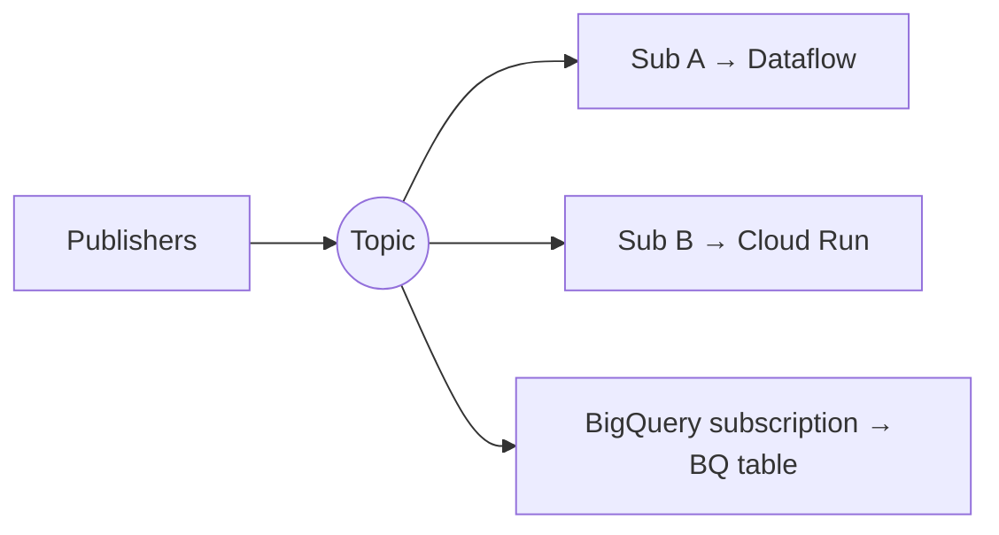

# Module 6: Streaming Ingestion with Pub/Sub

## Learning Objectives
- Model **topics, subscriptions**, and the publish/subscribe decoupling pattern.
- Choose **pull vs push vs BigQuery/GCS subscriptions** and **at-least-once vs
  exactly-once** delivery.
- Guarantee **message ordering** and handle poison messages with **dead-letter topics**.
- Enforce data contracts with **schemas** (Avro/Protobuf).
- Right-size **ack deadlines, retention, and flow control**.

---

## 1. The Model

Publishers send to a **topic**; each **subscription** is an independent, durable queue of
that topic's messages for one consumer group.



| Concept | Meaning |
|---------|---------|
| **Topic** | Named channel; publishers write here |
| **Subscription** | Durable cursor for one consumer; fan-out = many subs |
| **Ack** | Consumer confirms processing; unacked → redelivered after ack deadline |
| **Retention** | Unacked messages kept up to 7 days (31 with topic retention) |

## 2. Delivery Types

| Subscription type | Delivery | Use |
|-------------------|----------|-----|
| **Pull** | Consumer requests messages (streaming pull) | Dataflow, custom workers — highest throughput |
| **Push** | Pub/Sub POSTs to an HTTPS endpoint | Cloud Run/Functions, serverless webhooks |
| **BigQuery subscription** | Writes straight to a BQ table, **no code** | Simple ingest to BigQuery |
| **Cloud Storage subscription** | Batches to GCS files | Cheap archival / lake landing |

> **Exam tip:** need events in BigQuery with **no pipeline code**? Use a **BigQuery
> subscription**. Need transformation/windowing? Pull into **Dataflow** instead.

## 3. Delivery Semantics & Ordering

| Guarantee | Behavior | Cost |
|-----------|----------|------|
| **At-least-once** (default) | May redeliver duplicates | Cheapest, highest throughput |
| **Exactly-once** | No duplicates within a region | Slightly lower throughput |
| **Ordered delivery** | Messages with the same **ordering key** delivered in order | Requires ordering key + same region |

> **Pitfall:** ordering requires an **ordering key** on publish **and** an ordered
> subscription — and it constrains throughput per key. Don't enable it unless you truly
> need order. For idempotency, dedupe downstream (Dataflow/BigQuery) rather than relying
> solely on exactly-once.

## 4. Dead-Letter Topics (poison-message handling)

After `max_delivery_attempts`, Pub/Sub forwards the message to a **dead-letter topic** so
a bad message doesn't block the subscription forever.

```hcl
dead_letter_policy {
  dead_letter_topic     = google_pubsub_topic.dlq.id
  max_delivery_attempts = 5
}
```

> **Gotcha:** the **Pub/Sub service account** needs `publisher` on the DLQ topic and
> `subscriber` on the source subscription, or dead-lettering silently fails.

## 5. Schemas & Flow Control

- **Schemas** (Avro/Protobuf) attach to a topic to reject malformed messages at publish
  time — enforce your data contract early.
- **Ack deadline:** how long a consumer has to ack before redelivery (10s–600s). Too
  short → duplicate work; too long → slow recovery from crashes.
- **Flow control:** cap outstanding messages/bytes on the consumer to avoid overload.

---

## 6. Push Resilience, Retry Policies & Kafka Bridges

### Designing a resilient push subscription
When a push consumer (Cloud Run, an HTTP endpoint) has downtime or gets
overwhelmed, three knobs combine into the standard design:
1. **Retry policy = exponential backoff** (not immediate redelivery) — failed
   messages return gradually, so a recovering consumer isn't stampeded.
2. **Dead-letter topic with a max delivery attempts** (e.g., 10) — messages that
   keep failing park in a *different* topic (never the source topic — that would
   loop) for inspection and replay.
3. Unacked messages are retained (default 7 days), so consumer downtime alone
   loses nothing — the backlog drains on recovery.

The trio "survive downtime + retry gradually + capture poison messages after N
attempts" maps 1:1 to backoff policy + DLQ + retention.

### Replay & the Kafka boundary
Pub/Sub replays acked messages via **topic retention / retain-acked + seek**
(timestamp or snapshot) — within the retention window. If the requirement is
*seek to any offset back to the beginning of all history ever captured*, that's
**Kafka's** log model; keep Kafka (or Managed Service for Apache Kafka) and
bridge to GCP with the **Pub/Sub Kafka connector** or Dataflow `KafkaIO` rather
than forcing a migration.

## 🎯 Exam Focus

| Scenario | Answer |
|----------|--------|
| "Ingest events to BigQuery, minimal ops, no transform" | **BigQuery subscription** |
| "Transform/window/aggregate the stream" | Pull subscription → **Dataflow** |
| "Serverless HTTP handler per event" | **Push subscription** → Cloud Run |
| "Never process the same message twice" | **Exactly-once** subscription (+ idempotent sink) |
| "Per-user events must stay in order" | **Ordering key** + ordered subscription |
| "Some messages keep failing and block the queue" | **Dead-letter topic** + max attempts |
| "Reject malformed events at ingest" | Topic **schema** (Avro/Proto) |

### Practice Questions
1. **Land clickstream events in BigQuery with the least operational overhead.** →
   **BigQuery subscription** (direct write, no Dataflow).
2. **A downstream worker occasionally double-charges customers on redelivery.** → Enable
   **exactly-once delivery** and/or make the sink **idempotent** (dedupe on message_id).
3. **One malformed message is stuck redelivering forever.** → Configure a **dead-letter
   topic** with `max_delivery_attempts`, and grant the Pub/Sub SA publish on the DLQ.
4. **Bank transactions per account must be applied in publish order.** → Publish with an
   **ordering key = account_id** and use an **ordered** subscription (same region).
5. **You want to fan the same stream to Dataflow AND to an archival GCS store.** → Two
   subscriptions on one topic: a pull sub for Dataflow + a **Cloud Storage subscription**.
6. **A push endpoint is overwhelmed during spikes.** → Pub/Sub backs off automatically;
   tune the endpoint/flow control, or switch to **pull** with flow control.

---

## Key Takeaways
- Topics decouple producers from consumers; **each subscription is an independent queue**.
- Pick the subscription type by the sink: **BQ sub** (to BigQuery, no code), **pull** (to
  Dataflow), **push** (to serverless), **GCS sub** (archival).
- Default is **at-least-once** — design idempotent sinks; enable **exactly-once/ordering**
  only when required (they cost throughput).
- Use **dead-letter topics** for poison messages and **schemas** to enforce contracts.

Next: [Module 7 — Dataflow & Apache Beam](../module_07_dataflow_beam/README.md).

---

## Files in This Module
- `concepts.tf` — schema-validated topic, DLQ, pull subscription with exactly-once, and a
  BigQuery subscription
- `exercise.md` — build an ordered, dead-lettered ingestion path
- `solution.tf` — reference solution
