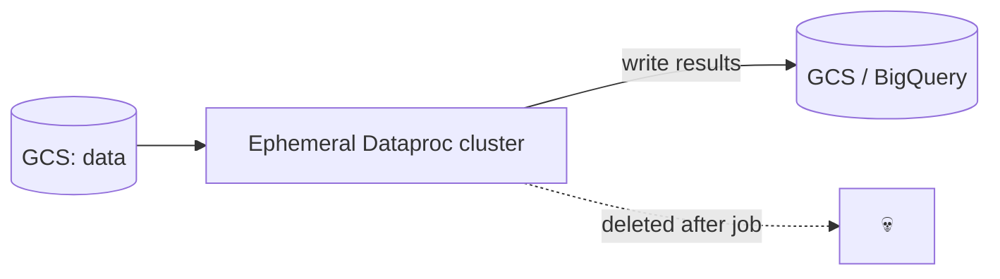

# Module 8: Dataproc & Spark

## Learning Objectives
- Run Spark/Hadoop on GCP with **Dataproc** clusters and **Serverless Spark** batches.
- Apply the **ephemeral, job-scoped cluster** pattern (compute separate from storage).
- Use **autoscaling**, **preemptible/Spot workers**, and initialization actions.
- Migrate on-prem Hadoop/Spark to GCP and know when Dataproc beats Dataflow/BigQuery.
- Read/write **GCS (not HDFS)** and integrate with BigQuery.

---

## 1. Dataproc Deployment Models

| Model | What | Use |
|-------|------|-----|
| **Cluster** | Managed Hadoop/Spark VMs you create/delete | Interactive, notebooks, long-running, custom components |
| **Serverless Spark (Batches)** | Submit a Spark job, no cluster to size | One-off/scheduled batch ETL, least ops |
| **Serverless Interactive** | Notebook sessions | Ad-hoc analysis |

> **Exam tip:** "run a Spark job without managing a cluster" → **Serverless Spark
> batch**. "need HBase/Presto/custom Hadoop ecosystem components or notebooks" → a
> **cluster**.

## 2. The Ephemeral Cluster Pattern

The cloud-native way: **don't keep a long-running cluster with data in HDFS.** Store data
in **GCS**, spin up a cluster for a job, run, then delete it. Compute is disposable;
storage is durable and shared.

| HDFS on a static cluster | GCS + ephemeral cluster |
|--------------------------|-------------------------|
| Pay for idle compute 24/7 | Pay only during jobs |
| Data locked to the cluster | Data shared, durable, versioned |
| Scaling = re-balance | Scaling = new cluster size |

Use `--max-idle` / scheduled deletion, or Cloud Composer/Workflow Templates to
create→submit→delete.

## 3. Cost Levers

| Lever | Effect |
|-------|--------|
| **Preemptible / Spot secondary workers** | Up to ~80% cheaper; can be reclaimed — use for fault-tolerant batch |
| **Autoscaling policy** | Grow/shrink workers by YARN pending memory |
| **Serverless** | No idle cost; pay per job |
| **Ephemeral clusters** | No idle cost between jobs |
| **`--max-idle`** | Auto-delete idle clusters |

> **Pitfall:** put **only secondary (not primary) workers** on Spot, and keep enough
> on-demand workers to hold shuffle data — losing all workers mid-shuffle fails the job.

## 4. Migration: On-Prem Hadoop → GCP

| On-prem | GCP target |
|---------|-----------|
| HDFS | **Cloud Storage** (via the GCS connector, `gs://`) |
| Hive metastore | **Dataproc Metastore** (managed) / BigQuery |
| Spark/MapReduce jobs | **Dataproc** (minimal code change) |
| Oozie | **Cloud Composer** (Airflow) |
| Impala/Presto | **BigQuery** or Dataproc Trino |

Lift-and-shift Spark first (Dataproc), then modernize hot paths to BigQuery/Dataflow.

## 5. Dataproc vs Dataflow vs BigQuery (again, sharper)

| Choose | When |
|--------|------|
| **Dataproc** | You already have **Spark/Hadoop/Hive** code or need those ecosystem tools |
| **Dataflow** | New pipelines, **streaming**, want fully-managed autoscaling Beam |
| **BigQuery** | The transform is expressible in **SQL** (ELT) |

---

## 🎯 Exam Focus

| Scenario | Answer |
|----------|--------|
| "Run existing PySpark nightly, no cluster management" | **Serverless Spark batch** |
| "Migrate on-prem Hadoop with minimal rewrite" | **Dataproc** + GCS (replace HDFS) |
| "Cut Dataproc cost for a fault-tolerant batch job" | **Spot secondary workers** + autoscaling |
| "Cluster sits idle between jobs" | **Ephemeral clusters** or `--max-idle`, or Serverless |
| "Need Hive metastore in the cloud" | **Dataproc Metastore** |
| "Replace Oozie workflows" | **Cloud Composer** |

### Practice Questions
1. **Nightly PySpark ETL, team doesn't want to manage clusters.** → **Dataproc Serverless
   batch**.
2. **On-prem Hadoop cluster (HDFS + Spark + Hive) must move to GCP cheaply and fast.** →
   **Dataproc** with data in **GCS**; Hive → **Dataproc Metastore**; keep Spark code.
3. **Batch job cost is too high on all-on-demand workers.** → Add **Spot secondary
   workers** (+ autoscaling), keep primaries on-demand for shuffle.
4. **A cluster is used a few hours/day but billed 24/7.** → Make it **ephemeral**
   (create→run→delete) or set `--max-idle`; or go **Serverless**.
5. **Transformation is just aggregations/joins expressible in SQL.** → Skip Spark; use
   **BigQuery**.

---

## Key Takeaways
- Prefer **Serverless Spark** or **ephemeral clusters** + **GCS** over static HDFS
  clusters — no idle cost, durable shared storage.
- Cut cost with **Spot secondary workers** + **autoscaling**; keep primaries on-demand.
- **Dataproc** = existing Spark/Hadoop; **Dataflow** = new/streaming; **BigQuery** = SQL.
- Migration: HDFS→GCS, Hive→Dataproc Metastore, Oozie→Composer.

Next: [Module 9 — Orchestration with Cloud Composer](../module_09_orchestration_composer/README.md).

---

## Files in This Module
- `concepts.tf` — an autoscaling ephemeral cluster (with Spot workers) and a Serverless
  Spark batch
- `job.py` — a PySpark job reading/writing GCS and BigQuery
- `exercise.md` — run a word-count as a Serverless batch
- `solution.tf` — reference solution
