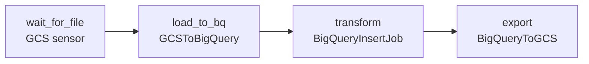

# Module 9: Orchestration with Cloud Composer (Airflow)

## Learning Objectives
- Model pipelines as **DAGs** of tasks with dependencies, schedules, and retries.
- Use GCP **operators** (BigQuery, Dataflow, Dataproc, GCS) and **sensors**.
- Design **idempotent, backfillable** pipelines with `execution_date`/`data_interval`.
- Pass data with **XCom**, secure connections, and handle failures/SLAs.
- Choose **Composer vs Workflows vs Cloud Scheduler vs Data Fusion**.

---

## 1. Airflow Core Concepts

**Cloud Composer** is managed Apache Airflow. You write Python that *defines* a DAG; the
scheduler runs task instances per schedule interval.

| Concept | Meaning |
|---------|---------|
| **DAG** | Directed acyclic graph of tasks + a schedule |
| **Operator / Task** | A unit of work (run a query, launch Dataflow…) |
| **Sensor** | A task that waits for a condition (file arrives, partition ready) |
| **XCom** | Small cross-task message passing |
| **Connection / Variable** | Stored credentials/config |
| **`data_interval`** | The time window a run processes (drives idempotency) |



## 2. Key Operators (data engineering)

| Operator | Does |
|----------|------|
| `GCSObjectExistenceSensor` | Wait for a file in GCS |
| `GCSToBigQueryOperator` | Load GCS → BigQuery |
| `BigQueryInsertJobOperator` | Run any SQL (query/DDL/DML) |
| `BigQueryToGCSOperator` | Export a table to GCS |
| `DataflowTemplatedJobStartOperator` / Flex | Launch Dataflow |
| `DataprocCreateBatchOperator` | Submit Serverless Spark |

## 3. Idempotency & Backfills (heavily tested)

A good pipeline can be **re-run for any date and produce the same result**. Achieve it by:
- Parameterizing on the run's **`data_interval_start`/`{{ ds }}`**, not "now".
- Writing to a **partition** for that date (`WRITE_TRUNCATE` of that partition), so a
  re-run overwrites rather than duplicates.
- Making sensors/loads **deterministic**.

```python
BigQueryInsertJobOperator(
  task_id="daily_rollup",
  configuration={"query": {
    "query": "DELETE FROM t WHERE d='{{ ds }}'; INSERT INTO t SELECT ... WHERE d='{{ ds }}'",
    "useLegacySql": False}})
```

> **Pitfall:** using `datetime.now()` or appending without a partition key makes re-runs
> **double-count**. Always key work to the run's logical date.

## 4. Reliability Features

| Feature | Use |
|---------|-----|
| `retries` / `retry_delay` | Transient failure recovery |
| `depends_on_past` | Serialize a chain when order matters |
| `sla` | Alert if a task runs late |
| `on_failure_callback` | Page/notify |
| Pools / priority | Throttle shared resources |
| `catchup=False` | Don't backfill every missed interval on deploy |

## 5. Composer vs Other Orchestrators

| Tool | Use |
|------|-----|
| **Cloud Composer** | Complex, multi-step, cross-service DAGs; the DE default |
| **Workflows** | Lightweight serverless orchestration of APIs (no Airflow overhead) |
| **Cloud Scheduler** | Simple cron trigger (kick off one job/HTTP) |
| **Data Fusion** | Visual, code-free ETL (CDAP) for citizen integrators |
| **Dataform / Dataplex** | SQL transformation orchestration (ELT in BigQuery) |

> **Exam tip:** "orchestrate a **multi-step** pipeline across BigQuery + Dataflow +
> Dataproc" → **Composer**. "just trigger one job on a schedule" → **Cloud Scheduler**.
> "serverless orchestration of a few API calls, cheap" → **Workflows**.

---

## 🎯 Exam Focus

| Scenario | Answer |
|----------|--------|
| "Complex dependency DAG across many services" | **Cloud Composer** |
| "Re-running yesterday must not duplicate rows" | Parameterize on `{{ ds }}` + partition **WRITE_TRUNCATE** |
| "Wait until the source file lands, then load" | **GCS sensor** → load operator |
| "Just fire an HTTP job nightly" | **Cloud Scheduler** |
| "Cheap serverless glue of a few APIs" | **Workflows** |
| "Don't backfill 300 past runs on first deploy" | `catchup=False` |
| "Code-free visual ETL for analysts" | **Data Fusion** |

### Practice Questions
1. **A nightly pipeline: wait for a GCS file → load to BigQuery → run a transform →
   export.** → **Composer** DAG: `GCSObjectExistenceSensor` → `GCSToBigQueryOperator` →
   `BigQueryInsertJobOperator` → `BigQueryToGCSOperator`.
2. **Backfilling last month double-counts revenue.** → Make it idempotent: key on
   `{{ ds }}`, overwrite the date **partition** (`WRITE_TRUNCATE`/`DELETE`+`INSERT`).
3. **You only need to trigger a single Cloud Run job every hour.** → **Cloud Scheduler**,
   not Composer.
4. **Deploying a new DAG with a 2-year start date triggers hundreds of runs.** → Set
   `catchup=False` (and/or a recent `start_date`).
5. **Analysts want drag-and-drop pipelines without code.** → **Data Fusion**.
6. **Serverless, low-cost orchestration of a handful of API calls.** → **Workflows**.

---

## Key Takeaways
- Composer = managed Airflow for **complex, cross-service DAGs**; use operators + sensors.
- **Idempotency** via logical date + partition overwrite is the #1 orchestration exam
  theme.
- Wire in **retries, SLAs, `catchup=False`, callbacks** from the start.
- Pick the lightest tool that fits: Scheduler < Workflows < Composer; Data Fusion for
  code-free ETL.

Next: [Module 10 — Governance, Security & Quality](../module_10_governance_security/README.md).

---

## Files in This Module
- `concepts.tf` — a Cloud Composer 2 environment sized small
- `dag.py` — an idempotent GCS→BigQuery→transform→export DAG
- `exercise.md` — build a backfillable daily pipeline
- `solution.py` — reference solution
