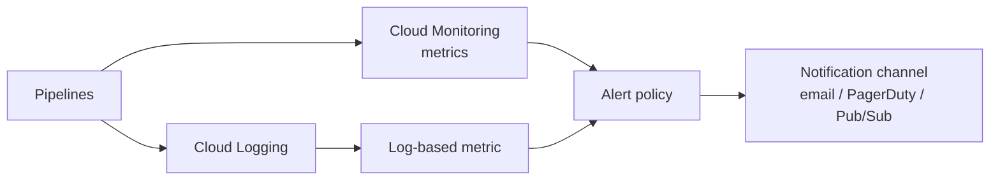

# Module 12: Reliability, Monitoring & Cost

## Learning Objectives
- Instrument pipelines with **Cloud Monitoring, Logging**, log-based metrics, and alerts.
- Define **SLIs/SLOs** and error budgets for data freshness and pipeline success.
- Control spend with **budgets/alerts, quotas, slot reservations, and lifecycle/partition
  expiration**.
- Build **CI/CD** for data pipelines (Terraform + tests + templated jobs).
- Ensure **DR/HA**: backups, multi-region, and recovery objectives.

---

## 1. Observability Stack

| Signal | Where | Use |
|--------|-------|-----|
| **Metrics** | Cloud Monitoring | Dataflow lag, BQ slot util, Pub/Sub backlog |
| **Logs** | Cloud Logging | Job errors, audit, DLP findings |
| **Log-based metrics** | Logging → Monitoring | Count error log lines → alert |
| **Traces / Error Reporting** | Cloud Trace / ER | Latency, exceptions |
| **Dashboards** | Monitoring | One pane per pipeline |

## 2. Key Signals to Watch

| Service | Watch |
|---------|-------|
| **Pub/Sub** | `subscription/num_undelivered_messages` (backlog), oldest unacked age |
| **Dataflow** | `system_lag`, `data_watermark_age`, failed elements |
| **BigQuery** | slot utilization, bytes scanned, job failures, MV staleness |
| **Composer** | DAG failure rate, task duration, scheduler heartbeats |
| **Bigtable** | CPU, storage utilization, error rate |

> **Pitfall:** a healthy-looking job with a **growing watermark lag / Pub/Sub backlog** is
> silently falling behind. Alert on **lag/backlog**, not just crashes.

## 3. SLIs, SLOs & Error Budgets

- **SLI** (indicator): e.g. "% of daily loads completing by 06:00", "data freshness < 15
  min".
- **SLO** (objective): e.g. "99% of days meet the freshness SLI."
- **Error budget:** the allowed miss (1%). Burn it → freeze risky changes, invest in
  reliability.

| Data-eng SLI | Example SLO |
|--------------|-------------|
| Freshness | 95% of hours, data lag < 15 min |
| Completeness | 99.9% of expected rows land |
| Success | 99% of pipeline runs succeed |

## 4. Cost Control Toolbox

| Lever | Applies to |
|-------|-----------|
| **Budgets + alerts** | Whole project/billing account |
| **BigQuery `maximum_bytes_billed`, reservations** | Query spend |
| **Partition/lifecycle expiration** | BQ & GCS storage |
| **Autoscaling caps** (`maxWorkers`, `max_nodes`) | Dataflow/Dataproc/Bigtable |
| **Quotas** | Prevent runaway usage |
| **Committed use / Spot / FlexRS** | Discounts |

> **Exam tip:** budgets **alert**, they don't automatically cap spend. To *stop* usage you
> wire the budget's Pub/Sub notification to a function that disables billing/quota.

## 5. CI/CD & DR for Data

- **CI/CD:** Terraform in a repo → `plan` on PR, `apply` on merge (Cloud Build/GitHub
  Actions); test SQL/DAGs; publish Dataflow templates; deploy DAGs to the Composer bucket.
- **HA/DR:** Cloud SQL **regional** + PITR; BigQuery **cross-region dataset replication**;
  GCS **dual/multi-region**; Bigtable **replicated clusters**; define **RPO/RTO**.

| Objective | Definition |
|-----------|-----------|
| **RPO** | Max acceptable data loss (how far back you can lose) |
| **RTO** | Max acceptable downtime (how fast you recover) |

---

## 🎯 Exam Focus

| Scenario | Answer |
|----------|--------|
| "Alert when a streaming pipeline falls behind" | Alert on **Pub/Sub backlog** / Dataflow **watermark lag** |
| "Get notified at 50/90/100% of budget" | **Billing budget** with threshold alerts |
| "Actually stop spend at the cap" | Budget → **Pub/Sub** → function that disables billing |
| "Guarantee data freshness objective" | Define an **SLO** on a freshness **SLI** + alert on burn |
| "Recover Cloud SQL to a point in time" | **PITR** + automated backups (regional HA) |
| "Deploy infra changes safely & repeatably" | **Terraform CI/CD** (plan on PR, apply on merge) |
| "Count error log lines and alert" | **Log-based metric** → alert policy |

### Practice Questions
1. **A streaming job runs but data is 2 hours stale; no crash.** → Alert on **Dataflow
   watermark lag** / **Pub/Sub undelivered backlog**, not just job failure.
2. **Finance wants email at 50%, 90%, 100% of the monthly budget.** → **Billing budget**
   with those threshold rules + a notification channel.
3. **They also want spend to actually stop at 100%.** → Route the budget alert to
   **Pub/Sub** → a Cloud Function that **disables billing** (budgets only notify).
4. **Define reliability targets for a nightly load.** → An **SLO** like "99% of nights load
   completes by 06:00," tracked against an **SLI**, with an **error budget**.
5. **Requirement: lose at most 5 min of OLTP data, recover in 30 min.** → **RPO=5min,
   RTO=30min** → Cloud SQL **regional HA + PITR** (or Spanner).
6. **Roll out dataset/table changes through review, reproducibly.** → **Terraform in
   CI/CD**: `plan` on PR, `apply` on merge.

---

## Key Takeaways
- Alert on **lag/backlog/freshness**, not only failures; use **log-based metrics** +
  alert policies + notification channels.
- Express reliability as **SLIs/SLOs with error budgets**.
- **Budgets alert; they don't cap** — automate a hard stop via Pub/Sub if required.
- **Terraform CI/CD** + **backups/PITR/replication (RPO/RTO)** make pipelines
  production-grade.

Next: [🏆 Capstone — RideShare Analytics Platform](../capstone/README.md).

---

## Files in This Module
- `concepts.tf` — a log-based metric, alert policy, notification channel, and a billing
  budget
- `cicd.yaml` — a Cloud Build pipeline (terraform plan/apply + validation)
- `exercise.md` — instrument a pipeline with an SLO alert and a budget
- `solution.tf` — reference solution
