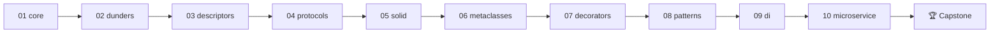

# Python OOP Mastery — from `class` to production architecture

Work through ten progressive modules and one capstone to go from writing basic classes
to designing a plugin-driven, dependency-injected service the way senior Python
engineers do. Every module pairs a deep-dive README with runnable code, a hands-on
exercise, and a reference solution — by the end you will not just *use* Python's object
model, you will be able to explain and extend it.

## Who This Is For
- Python developers who can write functions and scripts but want to design real systems.
- Engineers from Java/C# who need to unlearn "everything is a class" and learn what
  *Pythonic* OOP actually looks like (protocols, dunders, composition).
- Anyone preparing for senior Python interviews where descriptors, metaclasses, MRO,
  and SOLID trade-offs come up.

## How Each Module Is Structured
| File | Purpose |
|------|---------|
| `README.md` | Learning objectives + deep-dive concepts with tables and diagrams |
| `concepts.py` | Annotated, runnable examples — `python concepts.py` prints proof of every idea |
| `exercise.py` | Lab with numbered TODOs and self-verification checks |
| `solution.py` | Complete reference solution with commentary |

## The Curriculum
| # | Module | You Will Master |
|---|--------|-----------------|
| 01 | **[Core Object Model](module_01_core/README.md)** | Classes vs instances, `__init__`, class/static methods, properties, inheritance, MRO, name mangling |
| 02 | **[Dunder Methods](module_02_dunders/README.md)** | `__repr__`/`__eq__`/`__hash__`, operator overloading, `__call__`, context managers, `__new__` |
| 03 | **[Descriptors](module_03_descriptors/README.md)** | The descriptor protocol, data vs non-data descriptors, how `property` really works, `__slots__`, `__set_name__` |
| 04 | **[Protocols & ABCs](module_04_protocols/README.md)** | Duck typing, `collections.abc`, `typing.Protocol`, structural vs nominal typing, iterators |
| 05 | **[SOLID in Python](module_05_solid/README.md)** | All five principles with Pythonic (not Java-translated) implementations and when to break them |
| 06 | **[Metaclasses](module_06_metaclasses/README.md)** | `type`, class creation pipeline, custom metaclasses, `__init_subclass__`, registries |
| 07 | **[Decorators](module_07_decorators/README.md)** | Function/class decorators, `functools.wraps`, parameterized decorators, class-based decorators |
| 08 | **[Design Patterns](module_08_patterns/README.md)** | Singleton, Factory, Strategy, Observer, Adapter, Builder — the Pythonic versions |
| 09 | **[Dependency Injection](module_09_di/README.md)** | Constructor injection, protocols as seams, composition root, a minimal DI container |
| 10 | **[Microservice Architecture](module_10_microservice/README.md)** | Layered architecture: domain, repository, service, API layers built purely with OOP |
| 🏆 | **[Capstone](capstone/README.md)** | *PluginPay* — an extensible payment-processing service that applies every module |

## Prerequisites & Tooling
Python 3.11+ and a terminal — no third-party packages needed for any module.

```bash
python3 --version          # 3.11 or newer
cd oops_mastery
python3 module_01_core/concepts.py   # every concepts.py runs standalone
```

## Suggested Learning Path


Modules 1–4 teach the *object model* (mechanics), 5–7 teach the *machinery*
(principles and metaprogramming), 8–10 teach *architecture*. Do them in order —
later modules deliberately reuse earlier vocabulary.

## Ground Rules
1. **Run everything.** Each `concepts.py` prints and asserts observable results — read
   the output next to the source.
2. **Attempt every exercise before opening the solution.** The struggle is the course.
3. **Prefer composition over inheritance** — you'll see this rule earn its keep from
   Module 5 onward.
4. **Dunders are for the interpreter, not for you** — define them, never call them
   directly (`len(x)`, not `x.__len__()`).
5. If a class has no state, it probably wants to be a function. Python is not Java.

Start with [module_01_core](module_01_core/README.md).
