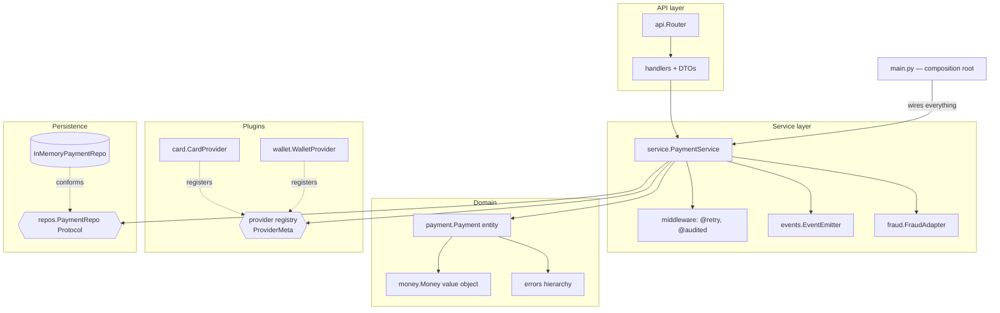

# Capstone: PluginPay — An Extensible Payment-Processing Service

## Overview
You will study, run, and then extend **PluginPay**: a payment service where new
payment providers plug in without touching core code, domain invariants make invalid
payments unrepresentable, failures are retried and audited by decorators, and the
whole graph is wired in one composition root. Every module of this course is load-
bearing somewhere in this tree — the mapping table below is the proof.

Your mastery test: complete the three extensions at the bottom **without reading any
module solutions**.

## Architecture


```
capstone/
├── README.md
└── pluginpay/
    ├── __init__.py
    ├── domain/
    │   ├── __init__.py
    │   ├── errors.py        # domain exception hierarchy
    │   ├── money.py         # Money value object (frozen, operators)
    │   └── payment.py       # Payment entity + validating descriptors
    ├── providers/
    │   ├── __init__.py      # ProviderMeta: registry + interface enforcement
    │   ├── card.py          # CardProvider plugin
    │   └── wallet.py        # WalletProvider plugin (flaky on purpose)
    ├── fraud.py             # legacy scorer + adapter
    ├── repos.py             # PaymentRepo protocol + in-memory impl
    ├── events.py            # observer/event emitter
    ├── middleware.py        # @retry and @audited decorators
    ├── service.py           # PaymentService use cases
    ├── api.py               # Router, Response, exception→status mapping
    └── main.py              # composition root + end-to-end demo
```

## Concepts Applied Per Module
| Module | Concept | Where in the Capstone |
|--------|---------|-----------------------|
| 01 Core | classmethod factory, properties, encapsulation | `Payment.create`, `Payment.status` property, `_history` |
| 02 Dunders | `__add__`/`__eq__`/`__hash__`/`__repr__` | `domain/money.py` operators; `Payment.__eq__` by id |
| 03 Descriptors | validated fields via `__set_name__` | `NonEmptyStr` descriptor on `Payment.customer` |
| 04 Protocols | structural seams | `repos.PaymentRepo`, `fraud.FraudChecker` |
| 05 SOLID | SRP layers, OCP plugins, DIP injection | the whole tree; providers extend without edits |
| 06 Metaclasses | registry + definition-time enforcement | `providers/__init__.py` `ProviderMeta` |
| 07 Decorators | parameterized + stateful wrappers | `middleware.retry`, `middleware.audited` |
| 08 Patterns | strategy, factory, observer, adapter | providers (strategy), `get_provider` (factory), `events.py`, `fraud.FraudAdapter` |
| 09 DI | constructor injection, composition root | `PaymentService.__init__`, `main.build_app` |
| 10 Microservice | layered architecture, DTOs, status mapping | `api.py` + package layout |

## How to Run
```bash
cd oops_mastery/capstone
python3 -m pluginpay.main          # runs the wired demo + built-in assertions
```

## How to Verify
```bash
python3 -m pluginpay.main
#   → prints each API call and response, ends with:
#   All capstone assertions passed ✔
```
The demo proves, end to end: a successful card charge (201), the plugin registry
serving both providers, a flaky wallet charge that succeeds via `@retry`, fraud
rejection (402), domain-invariant rejection (400), unknown payment (404), a refund
flow, the observer audit trail, and a provider added at runtime with zero core edits.

## Readiness / Mastery Checklist
Work through PluginPay and check yourself:
- [ ] I can explain why `Money` is frozen and `Payment` is not.
- [ ] I can trace what happens at import time when `card.py` defines `CardProvider`
      (metaclass pipeline) and why a provider missing `charge()` fails to even define.
- [ ] I can add a validated field to `Payment` with the existing descriptor in one line.
- [ ] I can explain why `service.py` imports no concrete repo, provider, or scorer.
- [ ] I can swap `InMemoryPaymentRepo` for a file-backed one by editing only `main.py`.
- [ ] I can say where a new HTTP status code would be introduced, and why nowhere else.

## Extend It (the actual mastery test)
1. **New plugin:** add `providers/bank_transfer.py` — succeeds only for amounts
   ≥ $1.00, refundable. Requirement: `main.py` must need only the import line.
2. **Idempotency keys:** clients pass `idempotency_key`; repeating a key returns the
   original payment instead of double-charging. (Descriptor or repo index? Decide and
   justify.)
3. **Webhooks:** subscribe an observer that collects `payment.captured` events into a
   `webhooks_sent` list, with one failing subscriber that must not break the flow.

## Cleanup
```bash
# nothing persisted — pure in-memory. Remove build artifacts if any:
find . -name __pycache__ -type d -exec rm -rf {} +
```
