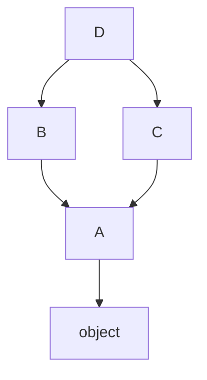

# Module 1: The Core Object Model

## Learning Objectives
- Explain what actually happens when Python executes a `class` statement and when you
  call `ClassName(...)`.
- Choose correctly between **instance**, **class**, and **static** methods — and know
  what `self` and `cls` really are.
- Use **properties** to expose computed/validated attributes without breaking callers.
- Read and predict the **Method Resolution Order (MRO)** for single and multiple
  inheritance, and use `super()` cooperatively.
- Apply Python's *conventions* for encapsulation (`_name`, `__name`) and know what name
  mangling does and does not protect.

---

## 1. Classes Are Objects, Instances Are Dictionaries (Mostly)

A `class` statement is executable code. Python runs the body, collects the resulting
names into a namespace, and calls `type(name, bases, namespace)` to build a **class
object**. That class object is itself an instance of `type` — this fact powers
everything in Module 6 (metaclasses).

```python
class Account:
    bank = "MegaBank"            # class attribute — lives on the CLASS
    def __init__(self, owner):   # runs on every instantiation
        self.owner = owner       # instance attribute — lives on the INSTANCE
```

| Where an attribute lives | Storage | Shared? | Lookup order |
|--------------------------|---------|---------|--------------|
| Instance attribute | `instance.__dict__` | No — per object | Checked **first** |
| Class attribute | `Account.__dict__` | Yes — all instances | Checked second |
| Base-class attribute | `Base.__dict__` | Yes | Checked along the MRO |

> **Pitfall:** a *mutable* class attribute (`items = []`) is shared by every instance.
> Appending via `self.items.append(...)` mutates the shared list. Initialize mutable
> state in `__init__`, always.

Attribute *assignment* on an instance never modifies the class — it creates a new
instance attribute that **shadows** the class one. This asymmetry (read falls through,
write does not) is the #1 source of "class attribute" bugs.

## 2. The Three Method Kinds

```python
class Temperature:
    scale = "celsius"

    def to_fahrenheit(self):          # instance method — needs per-object data
        return self.degrees * 9 / 5 + 32

    @classmethod
    def from_fahrenheit(cls, f):      # alternative constructor — the classic use
        return cls((f - 32) * 5 / 9)

    @staticmethod
    def is_valid(degrees):            # pure function, namespaced in the class
        return degrees >= -273.15
```

| Kind | First arg | Bound to | Use when |
|------|-----------|----------|----------|
| Instance method | `self` | the instance | Behavior needs instance state |
| `@classmethod` | `cls` | the class | Alternative constructors, class-level state |
| `@staticmethod` | — | nothing | Utility that belongs conceptually to the class |

`@classmethod` constructors respect subclassing: `FancyTemperature.from_fahrenheit(212)`
returns a `FancyTemperature` because `cls` *is* the subclass. A hardcoded
`Temperature(...)` inside the method would not.

## 3. Properties: Attributes with Behavior

Start with a plain attribute; upgrade to a `property` **only when you need logic** —
callers never notice the change. This is why Python has no "make everything a
getter/setter" culture.

```python
class Circle:
    def __init__(self, radius):
        self.radius = radius            # goes through the setter below!

    @property
    def radius(self):
        return self._radius

    @radius.setter
    def radius(self, value):
        if value <= 0:
            raise ValueError("radius must be positive")
        self._radius = value

    @property
    def area(self):                     # read-only computed attribute
        return 3.14159 * self._radius ** 2
```

> **Pitfall:** storing to `self.radius` inside the setter recurses forever. The backing
> field must have a different name — the `_radius` convention.

## 4. Inheritance, MRO, and `super()`

Python linearizes the inheritance graph with the **C3 algorithm**; the result is
`Class.__mro__`. Attribute lookup walks it left to right.



For `class D(B, C)` the MRO is `D → B → C → A → object` — the "diamond" visits `A`
**once**. `super()` does *not* mean "my parent"; it means **"the next class in the
MRO of `type(self)`"**. That's what makes cooperative multiple inheritance work:

```python
class A:
    def greet(self): print("A")
class B(A):
    def greet(self):
        print("B"); super().greet()
class C(A):
    def greet(self):
        print("C"); super().greet()
class D(B, C):
    def greet(self):
        print("D"); super().greet()

D().greet()      # D, B, C, A  — B's super() call reaches C, not A!
```

| Rule | Consequence |
|------|-------------|
| Every class appears once in the MRO | Diamonds are safe |
| Children precede parents; left bases precede right | `D(B, C)` puts B before C |
| Inconsistent orders raise `TypeError` at class creation | Fail fast, not at call time |

> **Pitfall:** in cooperative hierarchies, **every** `__init__` must call
> `super().__init__(...)` and pass along `**kwargs`, or the chain silently stops.

## 5. Encapsulation: Conventions, Not Locks

| Spelling | Meaning | Enforced? |
|----------|---------|-----------|
| `name` | Public API | — |
| `_name` | Internal — "don't touch unless you know why" | No (convention + `import *` skip) |
| `__name` | Name-mangled to `_ClassName__name` | Rewritten at compile time |
| `__name__` | Reserved for the language (dunders) | Never invent your own |

Name mangling exists to prevent **accidental override collisions in subclasses**, not
to provide privacy — `obj._ClassName__name` still works. Reach for `_single` by
default; `__double` only when you're writing a base class others will subclass.

---

## Key Takeaways
- Reads fall through instance → class → MRO; writes always land on the instance.
- `@classmethod` = polymorphic constructors; `@staticmethod` = namespaced helpers.
- Properties let you start with plain attributes and add logic later — no API break.
- `super()` follows the MRO of the *runtime* class, enabling cooperative diamonds.
- Encapsulation in Python is a social contract; mangling only prevents subclass clashes.

Next: [Module 2 — Dunder Methods](../module_02_dunders/README.md).

---

## Files in This Module
- `concepts.py` — every concept above, runnable with printed proof
- `exercise.py` — build a `BankAccount` hierarchy exercising all five concepts
- `solution.py` — reference solution
