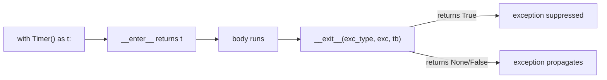

# Module 2: Dunder Methods — Speaking the Interpreter's Language

## Learning Objectives
- Implement the "identity trio" — `__repr__`, `__eq__`, `__hash__` — correctly,
  including the hash/eq contract.
- Overload operators (`+`, `<`, `*`) the right way: returning `NotImplemented`,
  supporting reflected operands, and using `functools.total_ordering`.
- Make objects sized, indexable, and iterable with `__len__`, `__getitem__`,
  `__contains__`.
- Build callables (`__call__`) and context managers (`__enter__`/`__exit__`).
- Explain the `__new__` vs `__init__` split and when you actually need `__new__`.

---

## 1. Why Dunders Exist

Python never calls `x.__add__` because you asked nicely — the *interpreter* calls it
when it sees `x + y`. Dunders are the hooks by which your objects plug into syntax,
built-ins, and protocols. Rule: **define them, never call them directly**
(`len(x)`, not `x.__len__()` — the built-in does extra correctness work).

| You write | Python calls |
|-----------|--------------|
| `x + y` | `x.__add__(y)`, falling back to `y.__radd__(x)` |
| `x == y` | `x.__eq__(y)` (fallback: identity) |
| `len(x)` | `x.__len__()` |
| `x in xs` | `xs.__contains__(x)` (fallback: iterate) |
| `for i in xs` | `xs.__iter__()` (fallback: `__getitem__` from 0) |
| `with x:` | `x.__enter__()` / `x.__exit__(...)` |
| `f(a)` | `f.__call__(a)` |
| `repr(x)`, `str(x)` | `x.__repr__()`, `x.__str__()` (str falls back to repr) |

## 2. The Identity Trio: `__repr__`, `__eq__`, `__hash__`

`__repr__` is for developers (debugger, logs); aim for *"could be pasted back into
Python"*. `__str__` is for end users and **falls back to `__repr__`** — so implement
`__repr__` first, `__str__` only if they must differ.

```python
class Money:
    def __init__(self, amount, currency):
        self.amount, self.currency = amount, currency

    def __repr__(self):
        return f"Money({self.amount!r}, {self.currency!r})"

    def __eq__(self, other):
        if not isinstance(other, Money):
            return NotImplemented          # let the OTHER side try
        return (self.amount, self.currency) == (other.amount, other.currency)

    def __hash__(self):
        return hash((self.amount, self.currency))
```

| Contract rule | Why |
|---------------|-----|
| `a == b` ⇒ `hash(a) == hash(b)` | Dicts/sets bucket by hash, then confirm with `==` |
| Defining `__eq__` sets `__hash__ = None` | Python assumes you forgot; unhashable by default |
| Hash only immutable state | Mutating a dict key strands it in the wrong bucket |
| Return `NotImplemented`, don't raise | Enables the reflected `other.__eq__(self)` retry |

> **Pitfall:** `NotImplemented` (a value you `return`) is not `NotImplementedError`
> (an exception you `raise`). Returning the value lets Python try the mirrored
> operation; raising kills the comparison.

## 3. Operator Overloading and Reflected Methods

For `a + b`, Python tries `a.__add__(b)`; if that returns `NotImplemented`, it tries
`b.__radd__(a)`. This is how `3 * vector` can work even though `int` knows nothing
about your vector.

```python
from functools import total_ordering

@total_ordering                      # derive <=, >, >= from __eq__ + __lt__
class Version:
    def __init__(self, *parts): self.parts = parts
    def __eq__(self, other): return self.parts == other.parts
    def __lt__(self, other): return self.parts < other.parts
```

> **Pitfall:** binary dunders should return a **new object**, not mutate `self` —
> mutation belongs in the in-place variants (`__iadd__` for `+=`).

## 4. Containers: `__len__`, `__getitem__`, `__iter__`

Implementing `__getitem__` alone already gives you `for` loops, `in`, and slicing
support (the legacy iteration protocol). Add `__len__` and your object works with
`len()`, truthiness, and `reversed()`.

```python
class Playlist:
    def __init__(self, songs): self._songs = list(songs)
    def __len__(self): return len(self._songs)
    def __getitem__(self, index): return self._songs[index]   # int OR slice
```

> **Pitfall:** `if obj:` calls `__bool__`, falling back to `__len__`. An empty custom
> container is falsy — guard with `if obj is not None:` when you mean "exists".

## 5. `__call__` and Context Managers

`__call__` turns instances into functions with memory — the OO alternative to
closures, and the mechanism behind class-based decorators (Module 7).

`__enter__`/`__exit__` guarantee cleanup. `__exit__(exc_type, exc, tb)` receives the
in-flight exception; **return `True` to suppress it**, anything falsy to propagate.



## 6. `__new__` vs `__init__`

| | `__new__` | `__init__` |
|---|-----------|-----------|
| Job | **Create** and return the instance | **Initialize** the created instance |
| First arg | `cls` | `self` |
| Returns | The new object | Must return `None` |
| Need it when | Subclassing immutables (`str`, `tuple`), interning/caching, singletons | Almost always |

If `__new__` returns an object that isn't an instance of `cls`, `__init__` is
**skipped entirely** — the escape hatch caching factories rely on.

---

## Key Takeaways
- Dunders are called *by the interpreter*; you write them, built-ins invoke them.
- `__eq__` without `__hash__` makes objects unhashable; hash only immutable state.
- Return `NotImplemented` from binary dunders so reflected operations get a chance.
- `__getitem__` alone unlocks iteration, membership, and slicing.
- `__new__` creates, `__init__` initializes — you rarely need the former.

Next: [Module 3 — Descriptors](../module_03_descriptors/README.md).

---

## Files in This Module
- `concepts.py` — all six sections, runnable with printed proof
- `exercise.py` — build a full-featured `Vector` and a `Stopwatch` context manager
- `solution.py` — reference solution
