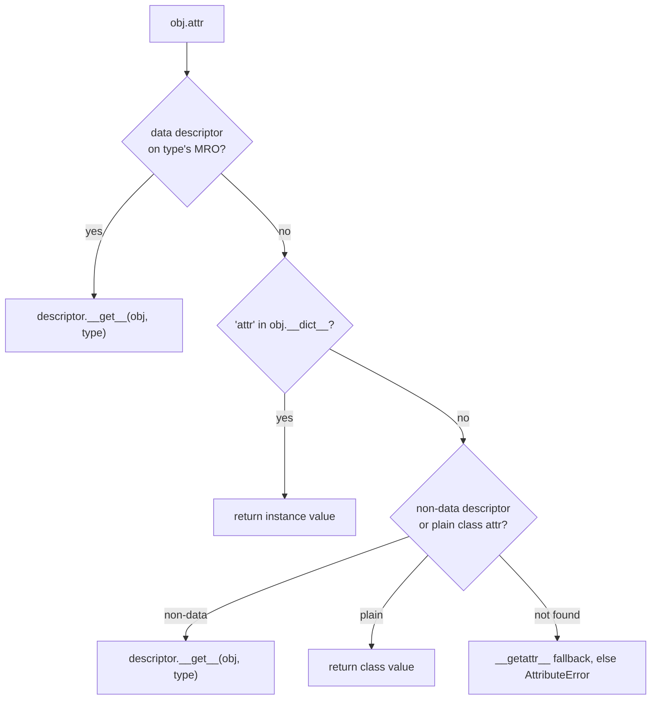

# Module 3: Descriptors — How Attributes Really Work

## Learning Objectives
- State the **descriptor protocol** (`__get__`, `__set__`, `__delete__`,
  `__set_name__`) and where descriptor objects must live to take effect.
- Distinguish **data** from **non-data** descriptors and predict which wins against
  `instance.__dict__`.
- Explain `property`, methods, `classmethod`, and `staticmethod` as descriptors —
  they are not magic, they are this protocol.
- Build reusable **validated fields** with `__set_name__`, eliminating property
  boilerplate.
- Use `__slots__` and know its trade-offs; know when `__getattr__` /
  `__getattribute__` fire.

---

## 1. The Protocol

A **descriptor** is any object whose *class* defines at least one of:

| Method | Called on | Makes it a |
|--------|-----------|------------|
| `__get__(self, obj, objtype)` | `instance.attr` (read) | non-data descriptor |
| `__set__(self, obj, value)` | `instance.attr = v` (write) | **data** descriptor |
| `__delete__(self, obj)` | `del instance.attr` | **data** descriptor |
| `__set_name__(self, owner, name)` | class creation | (helper — learns its own name) |

Two conditions must hold or nothing happens: the descriptor must be a **class
attribute** (not instance), and the protocol methods must be on the descriptor's
*type* (not attached to the instance).

## 2. The Lookup Algorithm (the heart of Python OOP)

`obj.attr` runs `type(obj).__getattribute__`, which resolves in this priority order:



| Kind | Defines | vs `instance.__dict__` |
|------|---------|------------------------|
| Data descriptor | `__set__` and/or `__delete__` | **Wins** (checked first) |
| Non-data descriptor | only `__get__` | **Loses** (instance dict shadows it) |

This single table explains two everyday facts: you can't shadow a `property` by
writing to the instance (data descriptor wins), and you *can* shadow a method by
assigning `obj.method = ...` (functions are non-data descriptors).

## 3. Everything You Already Use Is a Descriptor

| Built-in | `__get__` returns | Data? |
|----------|-------------------|-------|
| plain function | a **bound method** (self pre-filled) | No |
| `property` | result of your getter | **Yes** (even without a setter!) |
| `classmethod` | function bound to the class | No |
| `staticmethod` | the raw function | No |

A read-only `property` still defines `__set__` (it raises `AttributeError`) — that's
*why* it's read-only: the data descriptor intercepts the write before the instance
dict can absorb it.

## 4. Reusable Validated Fields with `__set_name__`

Properties don't scale: five validated fields = five getter/setter pairs. A
descriptor is written **once** and reused everywhere. `__set_name__` (Python 3.6+)
hands the descriptor its attribute name so it can pick a per-instance storage slot.

```python
class Positive:
    def __set_name__(self, owner, name):
        self._name = name                       # e.g. "price"

    def __get__(self, obj, objtype=None):
        if obj is None:                          # class access: Product.price
            return self
        return obj.__dict__[self._name]

    def __set__(self, obj, value):
        if value <= 0:
            raise ValueError(f"{self._name} must be positive")
        obj.__dict__[self._name] = value         # per-INSTANCE storage


class Product:
    price = Positive()
    stock = Positive()

    def __init__(self, price, stock):
        self.price, self.stock = price, stock    # both validated
```

> **Pitfall:** storing the value on the *descriptor* (`self._value = value`) shares
> one value across **all instances** — the descriptor is a class attribute. Store in
> `obj.__dict__[self._name]` (safe here: as a *data* descriptor it still wins the
> lookup race against that same dict entry).

## 5. `__slots__`

Declaring `__slots__ = ("x", "y")` replaces `__dict__` with fixed C-level slots —
implemented, fittingly, as data descriptors auto-created on the class.

| Benefit | Cost |
|---------|------|
| ~40-50% less memory per instance | No dynamic attributes |
| Slightly faster attribute access | No `__dict__` (breaks some tooling) |
| Typo'd assignments raise immediately | Every class in the hierarchy must cooperate |

> **Pitfall:** if any base class lacks `__slots__` (e.g. plain `object` subclass in
> between), instances get a `__dict__` anyway and the memory win evaporates.

## 6. The Fallback Hooks

| Hook | Fires when | Typical use |
|------|-----------|-------------|
| `__getattribute__` | **every** attribute read | Almost never override (easy infinite recursion) |
| `__getattr__` | only when normal lookup **fails** | Proxies, lazy loading, delegation |
| `__setattr__` | every attribute write | Freezing objects, write logging |

> **Pitfall:** inside `__setattr__`, writing `self.x = v` recurses forever. Use
> `super().__setattr__(name, value)` or `object.__setattr__`.

---

## Key Takeaways
- Descriptors are class attributes whose type implements `__get__`/`__set__`.
- Data descriptors beat the instance dict; non-data descriptors lose to it.
- `property`, methods, `classmethod`, `staticmethod` — all just descriptors.
- `__set_name__` + `obj.__dict__` storage = reusable validated fields, zero boilerplate.
- `__slots__` trades flexibility for memory; `__getattr__` fires only on failure.

Next: [Module 4 — Protocols & ABCs](../module_04_protocols/README.md).

---

## Files in This Module
- `concepts.py` — the protocol, lookup priority, validators, slots, fallbacks
- `exercise.py` — build `Typed`, `Bounded`, and `LazyProperty` descriptors
- `solution.py` — reference solution
