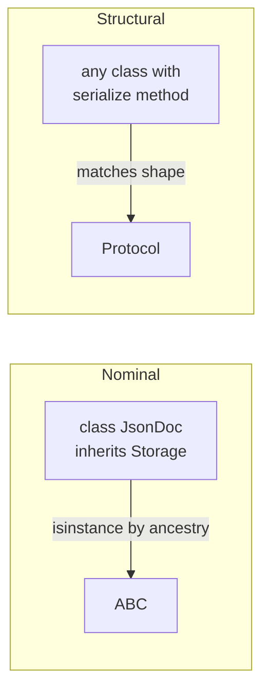

# Module 4: Protocols, ABCs & Structural Typing

## Learning Objectives
- Articulate **duck typing** and why idiomatic Python checks *behavior*, not type.
- Use `collections.abc` both to **test** capabilities (`isinstance(x, Iterable)`) and
  to **inherit** mixin methods for free.
- Define **Abstract Base Classes** with `@abstractmethod` and know exactly when
  instantiation fails.
- Write **`typing.Protocol`** classes for static *and* (with `@runtime_checkable`)
  runtime structural checks — and know their limits.
- Implement the **iterator protocol** correctly (iterable vs iterator, why `__iter__`
  returning `self` makes one-shot iterators).

---

## 1. Duck Typing: Capability over Ancestry

`len(x)` doesn't care what `x` *is* — only that it defines `__len__`. Python's
standard library is built on this: `json.dump` accepts anything with `.write`,
`for` accepts anything with `__iter__`. The cost: errors surface at *call time*,
deep in the stack. Modules 4's tools exist to move that error earlier.

| Style | Check | Error appears |
|-------|-------|---------------|
| EAFP duck typing | none — just call it | mid-operation (`AttributeError`) |
| ABC `isinstance` | nominal or `__subclasshook__` | at the boundary |
| `typing.Protocol` | structural, static | in the type checker, before running |

## 2. `collections.abc`: Interfaces You Already Satisfy

Two superpowers:

**a) Capability testing.** `isinstance(x, Iterable)` is `True` for *any* class
defining `__iter__` — even with no inheritance — because these ABCs implement
`__subclasshook__` to check for the methods structurally.

**b) Mixin methods.** Inherit and implement a tiny core; the ABC derives the rest:

| ABC | You implement | You get for free |
|-----|---------------|------------------|
| `Sequence` | `__getitem__`, `__len__` | `__contains__`, `__iter__`, `__reversed__`, `index`, `count` |
| `Mapping` | `__getitem__`, `__len__`, `__iter__` | `keys`, `values`, `items`, `get`, `__eq__`, `__contains__` |
| `MutableSequence` | + `__setitem__`, `__delitem__`, `insert` | `append`, `extend`, `pop`, `remove`, `+=` |
| `Set` | `__contains__`, `__iter__`, `__len__` | `&`, `|`, `-`, `^`, comparisons |

> **Pitfall:** the free `Sequence.__contains__` and `.index` are O(n) scans. Override
> them when your data structure can do better (e.g., a sorted sequence → bisect).

## 3. Abstract Base Classes

```python
from abc import ABC, abstractmethod

class Storage(ABC):
    @abstractmethod
    def save(self, key: str, data: bytes) -> None: ...

    @abstractmethod
    def load(self, key: str) -> bytes: ...

    def copy(self, src: str, dst: str) -> None:      # concrete: uses abstracts
        self.save(dst, self.load(src))
```

Rules that surprise people:

| Fact | Consequence |
|------|-------------|
| Instantiation fails only if abstract methods remain | Subclass missing one method = still abstract |
| The check happens at **instantiation**, not definition | You can define incomplete subclasses freely |
| Abstract methods can have bodies | Subclasses may call `super().save(...)` for shared logic |
| `Storage.register(Thing)` — virtual subclass | `isinstance` passes but **nothing is verified** |
| Works with `@property`, `@classmethod`, `@staticmethod` | Stack `@abstractmethod` **innermost** |

> **Pitfall:** ABCs are *nominal* — a class with a perfect `save`/`load` that doesn't
> inherit `Storage` fails `isinstance`. When you don't own the class, that's a wall.
> Protocols knock it down.

## 4. `typing.Protocol`: Structural Typing

A `Protocol` declares a *shape*. Anything with matching methods conforms — no
inheritance, no registration. This is duck typing formalized for type checkers.

```python
from typing import Protocol, runtime_checkable

@runtime_checkable
class Serializer(Protocol):
    def serialize(self) -> str: ...

def export(item: Serializer) -> str:     # mypy checks structurally
    return item.serialize()
```



| | ABC | Protocol |
|---|-----|----------|
| Conformance | inherit / register | just have the methods |
| Third-party classes | must be registered | conform automatically |
| Mixin methods | yes — big win | no (non-protocol members aren't inherited that way) |
| Runtime `isinstance` | always | only with `@runtime_checkable` |
| Checks method **signatures** at runtime | n/a | **No — presence only!** |

> **Pitfall:** `@runtime_checkable` `isinstance` checks only that the *names exist as
> callables* — `serialize(self, x, y, z)` still passes. Full signature checking is the
> static checker's job.

**Rule of thumb:** own the hierarchy and want shared behavior → ABC. Describing what
you *accept* (especially third-party objects) → Protocol.

## 5. The Iterator Protocol

| Term | Must define | Contract |
|------|-------------|----------|
| **Iterable** | `__iter__` → returns an iterator | can be looped over, many times |
| **Iterator** | `__next__` + `__iter__` returning `self` | produces values, raises `StopIteration` when done — then is **exhausted forever** |

A container should be **iterable but not its own iterator** — return a fresh iterator
(easiest: make `__iter__` a generator) so two loops don't steal from each other.

```python
class Countdown:
    def __init__(self, start): self.start = start
    def __iter__(self):                  # generator = fresh iterator each call
        n = self.start
        while n > 0:
            yield n
            n -= 1
```

> **Pitfall:** implementing `__next__` on the container and returning `self` from
> `__iter__` means the *second* `for` loop over the object silently does nothing.

---

## Key Takeaways
- `collections.abc` gives structural `isinstance` checks *and* free mixin methods.
- ABC = nominal contract + shared implementation; fails fast at instantiation.
- Protocol = structural contract; perfect for typing what you accept; runtime checks
  verify names only.
- Containers return fresh iterators; iterators are one-shot by contract.

Next: [Module 5 — SOLID in Python](../module_05_solid/README.md).

---

## Files in This Module
- `concepts.py` — duck typing, abc mixins, ABCs, Protocols, iterators — all runnable
- `exercise.py` — build a `SortedItems` Sequence, a `Notifier` ABC and a Protocol-typed pipeline
- `solution.py` — reference solution
