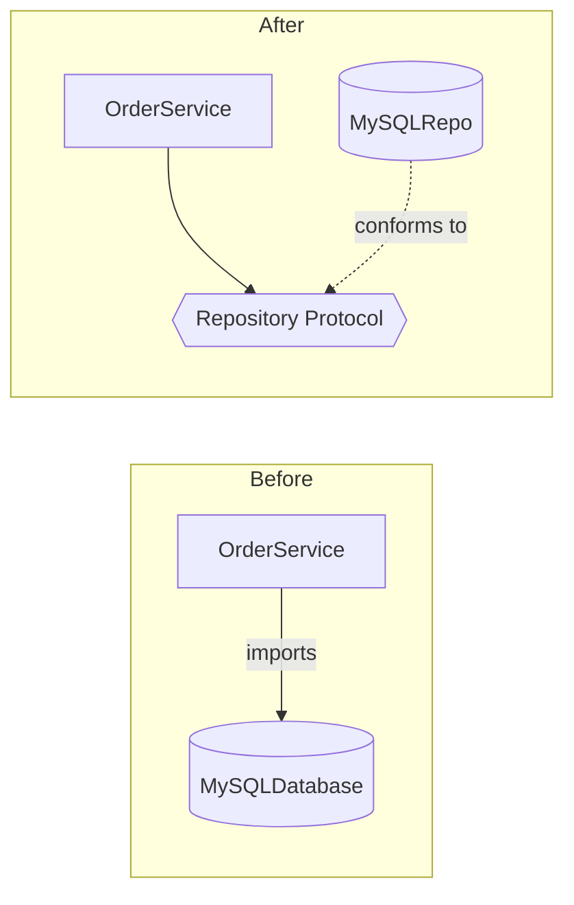

# Module 5: SOLID — Principles, the Pythonic Way

## Learning Objectives
- Apply each SOLID principle with idiomatic Python (protocols and functions, not
  Java-style interface explosions).
- Recognize each principle's **violation smell** in real code and know the standard
  refactor.
- Explain LSP as a behavioral contract (not just "subclass compiles") and connect it
  to the classic Rectangle/Square trap.
- Use **Dependency Inversion** with `typing.Protocol` — the design seam Module 9
  builds a whole DI system on.
- Judge when a principle costs more than it pays (YAGNI vs OCP).

---

## 1. S — Single Responsibility

*A class should have one reason to change.* Smell: a class named after a noun that
does I/O **and** business rules **and** formatting.

```python
# ✗ Report: computes, formats, AND writes files — three reasons to change
# ✓ split: ReportData (compute) / ReportFormatter (format) / ReportWriter (persist)
```

| Symptom | Refactor |
|---------|----------|
| "and" in the class description | Split along the "and" |
| Test needs a filesystem to check math | Extract pure logic |
| Import block mixes domains (smtplib + decimal) | One class per domain |

SRP is about **cohesion of change**, not size — a 200-line parser with one job is
fine; a 40-line `UserManager` doing auth + email is not.

## 2. O — Open/Closed

*Open for extension, closed for modification.* Smell: an `if/elif` chain over a type
tag that grows with every feature.

```python
# ✗ closed for extension:
def price(shape):
    if shape.kind == "circle": ...
    elif shape.kind == "square": ...    # every new shape edits this function

# ✓ each variant brings its own behavior:
class Shape(Protocol):
    def area(self) -> float: ...
```

Pythonic extension points, cheapest first: **a function argument** (pass `key=` like
`sorted` does) → **a registry dict** → **polymorphic classes**. All three close the
core against edits.

> **Pitfall:** OCP taken too early = abstraction for cases that never arrive. Wait for
> the *second* concrete variant before building the extension point (rule of three).

## 3. L — Liskov Substitution

*Code that works with the base class must keep working — behaviorally — with any
subclass.* The compiler can't check this; it's about honoring the contract.

| Contract rule | Subclass may | Subclass must NOT |
|---------------|--------------|-------------------|
| Preconditions | weaken (accept more) | strengthen (demand more) |
| Postconditions | strengthen (promise more) | weaken (deliver less) |
| Invariants | preserve | break |
| Exceptions | raise fewer/narrower | raise new, unexpected types |

The classic trap: `Square(Rectangle)` — setting `width` on a square silently changes
`height`, breaking the invariant every `Rectangle` caller relies on. Mathematically a
square *is a* rectangle; behaviorally (with mutable setters) it is not. **Fix:**
model both as immutable values or drop the inheritance.

> **Smell:** a subclass method that raises `NotImplementedError` for an inherited
> operation is a confession that the "is-a" relationship is fake.

## 4. I — Interface Segregation

*No client should depend on methods it doesn't use.* A fat ABC forces every
implementation to stub methods with `raise NotImplementedError` — which is an LSP
violation manufactured by the interface itself.

```python
# ✗ class Machine(ABC): print(), scan(), fax()      # old printer can't scan
# ✓ class Printer(Protocol): def print(...) ...
#   class Scanner(Protocol): def scan(...) ...
# a multifunction device just implements both.
```

Python makes ISP nearly free: small `Protocol`s cost one class statement, and a class
conforms to any number of them **implicitly**.

## 5. D — Dependency Inversion

*High-level policy should not import low-level detail; both depend on an
abstraction.* The direction of the **import arrow** is the whole principle:



```python
class OrderRepository(Protocol):
    def add(self, order: Order) -> None: ...

class OrderService:
    def __init__(self, repo: OrderRepository):   # injected, not constructed
        self._repo = repo
```

The service is now testable with an in-memory fake and retargetable to Postgres
without edits. The place where real implementations get chosen and wired is the
**composition root** — Module 9's subject.

## When to Break the Rules

| Principle | Skip it when |
|-----------|--------------|
| SRP | The script is 50 lines and will stay 50 lines |
| OCP | There is exactly one variant (YAGNI) |
| LSP | Never — this one is a correctness rule |
| ISP | The interface has one implementer and one client |
| DIP | The "low-level detail" is the standard library |

---

## Key Takeaways
- SRP = one reason to change; split classes along their "and"s.
- OCP = new behavior arrives as new code (registry/polymorphism), not edits.
- LSP = subclasses honor behavioral contracts; `NotImplementedError` in a subclass is
  a design alarm.
- ISP = many small Protocols beat one fat ABC — and cost nothing in Python.
- DIP = point import arrows at abstractions; inject implementations.

Next: [Module 6 — Metaclasses](../module_06_metaclasses/README.md).

---

## Files in This Module
- `concepts.py` — each principle as a violation → refactor pair, runnable
- `exercise.py` — refactor a deliberately awful `OrderManager` into SOLID shape
- `solution.py` — reference solution
