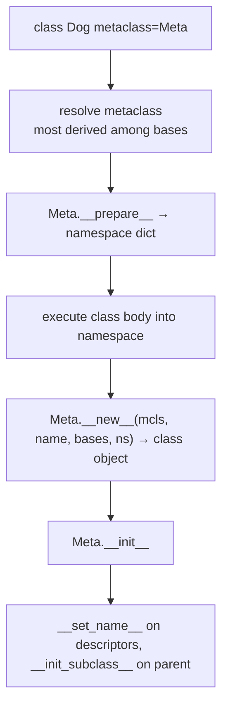

# Module 6: Metaclasses — Classes That Build Classes

## Learning Objectives
- Trace the **class creation pipeline**: body execution → namespace →
  `metaclass(name, bases, ns)` → class object.
- Use `type(name, bases, ns)` to create classes dynamically.
- Write a custom metaclass overriding `__new__` and `__call__`, and know what each
  hook controls.
- Reach for the lighter alternatives first: **`__init_subclass__`** and
  **class decorators** — and justify when a real metaclass is warranted.
- Build the two canonical metaclass applications: a **plugin registry** and an
  **enforced-interface** check at class-definition time.

---

## 1. Classes Are Instances of `type`

Everything is an object; every object has a type; the type of a class is `type`.

```python
class Dog: ...
type(Dog)          # <class 'type'>       Dog is an INSTANCE of type
type(type)         # <class 'type'>       type is its own type (the fixed point)
```

So a `class` statement is sugar for a **call to `type`**:

```python
Dog = type("Dog", (), {"sound": "woof", "speak": lambda self: self.sound})
```

A **metaclass** is any subclass of `type` used in that call instead of `type` itself.

## 2. The Class Creation Pipeline



| Hook on the metaclass | Fires when | Controls |
|-----------------------|-----------|----------|
| `__prepare__` | before the body runs | the namespace mapping (e.g. ordered/validating dict) |
| `__new__` | class definition | inspect/modify/replace the class being built |
| `__init__` | class definition | post-creation setup |
| `__call__` | **`Dog()`** — instantiation! | the whole instance-creation protocol |

That last row is the key insight: `Dog(...)` invokes `type(Dog).__call__(Dog, ...)`,
which then runs `Dog.__new__` and `Dog.__init__`. Override `Meta.__call__` and you
control instantiation itself — the cleanest singleton in Python.

> **Pitfall:** two bases with different unrelated metaclasses ⇒
> `TypeError: metaclass conflict`. The fix is a metaclass inheriting from both —
> and a strong hint you're over-engineering.

## 3. The Canonical Uses

**Registry** — every subclass registers itself at *definition* time:

```python
class PluginMeta(type):
    registry = {}
    def __new__(mcls, name, bases, ns):
        cls = super().__new__(mcls, name, bases, ns)
        if bases:                                  # skip the abstract root
            mcls.registry[name.lower()] = cls
        return cls
```

**Enforcement** — fail at *definition*, not first use:

```python
class InterfaceMeta(type):
    def __new__(mcls, name, bases, ns):
        cls = super().__new__(mcls, name, bases, ns)
        if bases and not callable(ns.get("execute")):
            raise TypeError(f"{name} must define execute()")
        return cls
```

**Singleton via `__call__`:**

```python
class SingletonMeta(type):
    _instances = {}
    def __call__(cls, *a, **kw):
        if cls not in cls._instances:
            cls._instances[cls] = super().__call__(*a, **kw)
        return cls._instances[cls]
```

## 4. The Lighter Alternatives (use these first)

**`__init_subclass__`** (Python 3.6+) — a classmethod on a *plain base class* that
runs for every subclass. It covers ~90% of registry/validation needs with zero
metaclass machinery, and composes cleanly with other bases:

```python
class Plugin:
    registry = {}
    def __init_subclass__(cls, /, key=None, **kwargs):
        super().__init_subclass__(**kwargs)
        Plugin.registry[key or cls.__name__.lower()] = cls

class CsvExporter(Plugin, key="csv"): ...       # kwargs flow from the class stmt!
```

**Class decorators** — transform one class explicitly, no inheritance needed:

```python
@dataclass                 # the most successful "metaclass avoided" in Python
class Point: ...
```

| Need | Reach for |
|------|-----------|
| React when subclasses are defined | `__init_subclass__` |
| Transform one class you own | class decorator |
| Descriptors need their names | `__set_name__` (automatic) |
| Control **instantiation** (`__call__`) | metaclass |
| Control the **namespace** (`__prepare__`) | metaclass |
| Framework where classes ARE the API (ORMs, ABCs) | metaclass |

> **Pitfall:** "I need a metaclass" is usually false. Django models and `abc.ABC`
> earn theirs by controlling instantiation and namespace collection. A registry does
> not. As Tim Peters put it: if you wonder whether you need them, you don't.

---

## Key Takeaways
- `class` is sugar for `metaclass(name, bases, namespace)`; the default metaclass is `type`.
- `Meta.__new__` runs at class **definition**; `Meta.__call__` runs at **instantiation**.
- Registries and validation usually want `__init_subclass__`, not a metaclass.
- Metaclasses shine when you must control instantiation, the class namespace, or
  build a framework where class definitions are the user interface.

Next: [Module 7 — Decorators](../module_07_decorators/README.md).

---

## Files in This Module
- `concepts.py` — dynamic classes, the pipeline, singleton/registry/enforcement, `__init_subclass__`
- `exercise.py` — build `ValidatedMeta` + a plugin system with `__init_subclass__`
- `solution.py` — reference solution
