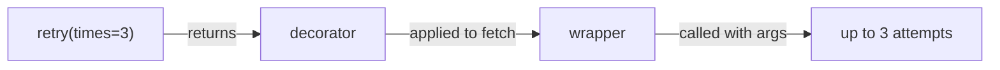

# Module 7: Decorators — Wrapping Behavior Around Code

## Learning Objectives
- Explain a decorator as plain function application: `@d` ⇔ `f = d(f)`.
- Write closure-based decorators that preserve identity with `functools.wraps`.
- Build **parameterized decorators** (the three-layer pattern) and decorators that
  work **with or without** arguments.
- Write **class-based decorators** (`__call__` + `__get__`) and know when state makes
  them the better tool.
- Decorate **classes** themselves, and connect the whole module back to descriptors
  (`property`, `classmethod` are decorators *and* descriptors).

---

## 1. Sugar, Nothing More

```python
@timing
def fetch(): ...
# is EXACTLY:
def fetch(): ...
fetch = timing(fetch)
```

Decoration happens **once, at definition time** (import time for module-level code).
The wrapper runs at every call; the decorator itself does not.

| Moment | What runs |
|--------|-----------|
| `def` / import | the decorator body (once) |
| each call | the returned wrapper |

> **Pitfall:** expensive work in the decorator body slows *import*; state created
> there (a cache dict) is shared across **all** calls — sometimes the point, sometimes
> a leak.

## 2. The Standard Shape

```python
import functools

def timing(func):
    @functools.wraps(func)                     # copy name/doc/signature metadata
    def wrapper(*args, **kwargs):
        start = time.perf_counter()
        try:
            return func(*args, **kwargs)
        finally:
            print(f"{func.__name__}: {time.perf_counter() - start:.4f}s")
    return wrapper
```

Why `@functools.wraps` is non-negotiable:

| Without it | Consequence |
|------------|-------------|
| `fetch.__name__ == "wrapper"` | logs/tracebacks lie |
| docstring gone | `help()` broken |
| `__wrapped__` missing | can't unwrap for testing |
| identity mismatch | some frameworks (registry-by-name) misroute |

## 3. Parameterized Decorators: Three Layers

`@retry(times=3)` — the outer call returns the *actual decorator*:

```python
def retry(times=3, exceptions=(Exception,)):     # 1. factory: takes options
    def decorator(func):                         # 2. decorator: takes func
        @functools.wraps(func)
        def wrapper(*args, **kwargs):            # 3. wrapper: takes call args
            for attempt in range(times):
                try:
                    return func(*args, **kwargs)
                except exceptions:
                    if attempt == times - 1:
                        raise
        return wrapper
    return decorator
```



The **with-or-without-args** trick (`@log` and `@log(level="INFO")` both work): if the
first positional arg is callable, you were used bare — decorate it directly.

## 4. Class-Based Decorators

When a decorator accumulates **state** (call counts, cache, rate-limit buckets), a
class beats a closure — state lives in named attributes, inspectable from outside.

```python
class CountCalls:
    def __init__(self, func):
        functools.update_wrapper(self, func)     # wraps, for classes
        self.func, self.calls = func, 0

    def __call__(self, *args, **kwargs):
        self.calls += 1
        return self.func(*args, **kwargs)

    def __get__(self, obj, objtype=None):        # needed to decorate METHODS
        return types.MethodType(self, obj)       # bind like a function would
```

> **Pitfall:** without `__get__`, a class-based decorator on a *method* breaks —
> `self` never arrives, because the instance isn't a descriptor and can't produce a
> bound method. Functions get this for free (Module 3); your class must opt in.

## 5. Decorating Classes

A class decorator receives the class and returns it (usually mutated) — the explicit,
lighter cousin of metaclasses for the transform-one-class case.

```python
def auto_repr(cls):
    def __repr__(self):
        fields = ", ".join(f"{k}={v!r}" for k, v in vars(self).items())
        return f"{cls.__name__}({fields})"
    cls.__repr__ = __repr__
    return cls

@auto_repr
class Point:
    def __init__(self, x, y): self.x, self.y = x, y
```

`@dataclass` and `functools.total_ordering` are exactly this pattern.

## 6. Stacking

```python
@a
@b
def f(): ...        # f = a(b(f)) — bottom-up application, top-down at call time
```

Order matters: `@timing` above `@retry` times all attempts together; below it, each
attempt separately.

---

## Key Takeaways
- `@d` is `f = d(f)`, executed once at definition time.
- Always `functools.wraps`; parameterized decorators are a factory returning a decorator.
- Class-based decorators hold state cleanly but need `__get__` to work on methods.
- Class decorators transform classes explicitly — reach for them before metaclasses.
- Stacked decorators apply bottom-up.

Next: [Module 8 — Design Patterns](../module_08_patterns/README.md).

---

## Files in This Module
- `concepts.py` — every pattern above, runnable
- `exercise.py` — build `@memoize`, `@retry`, a `RateLimiter` class decorator, and `@auto_str`
- `solution.py` — reference solution
