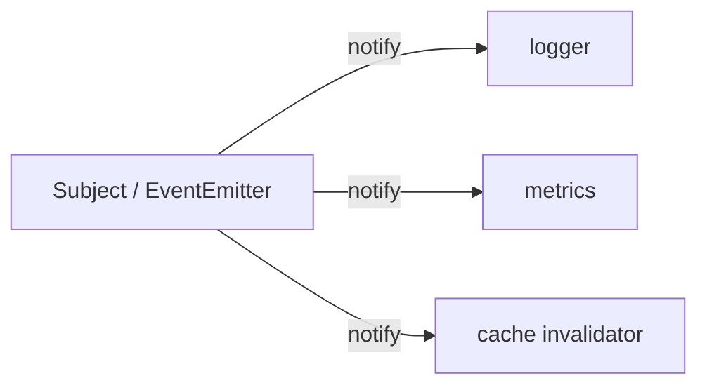

# Module 8: Design Patterns — The Pythonic Versions

## Learning Objectives
- Implement six core patterns — Singleton, Factory, Strategy, Observer, Adapter,
  Builder — in idiomatic Python.
- Recognize when a GoF pattern **collapses into a language feature** (first-class
  functions, modules, kwargs) and ship the simpler version.
- Choose the right variant: module-level singleton vs metaclass; registry factory vs
  `if` ladder; function strategy vs class strategy.
- Wire an event-driven **Observer** with proper unsubscribe and error isolation.
- Know each pattern's failure modes (singleton = global state, observer = hidden
  control flow).

---

## 1. Patterns Are a Vocabulary, Not a Shopping List

The GoF book targeted C++/Java, languages without first-class functions or modules.
Python absorbs several patterns outright:

| GoF pattern | Pythonic reality |
|-------------|------------------|
| Strategy | often just **pass a function** (`sorted(key=...)`) |
| Command | a callable / `functools.partial` |
| Iterator | built into the language (`__iter__`, generators) |
| Template Method | ABC with concrete method calling abstract ones (Module 4) |
| Decorator (GoF) | usually `@decorator` syntax (Module 7) |
| Singleton | **a module** — imported once, shared everywhere |

Use the class-based version when you need *state, multiple methods, or swapping at
runtime*; use the language feature when you don't.

## 2. Singleton

Three implementations, in order of preference:

| Variant | How | Trade-off |
|---------|-----|-----------|
| **Module** | put state/functions at module top level | simplest; the import system guarantees "once" |
| **Metaclass** | `SingletonMeta.__call__` caches instances (Module 6) | transparent to callers; testing pain |
| `__new__` cache | override `__new__` | `__init__` re-runs on every call! |

> **Pitfall:** the `__new__` variant re-runs `__init__` each time `Singleton()` is
> called, silently resetting state. The metaclass variant avoids this because
> `Meta.__call__` skips the whole construction pipeline on a cache hit.
> Bigger pitfall: a singleton is global state — inject it (Module 9) rather than
> importing it everywhere, or tests will fight each other.

## 3. Factory

The goal: callers say *what* they want, not *which class* to construct.

```python
class Exporter(Protocol):
    def export(self, data) -> str: ...

_EXPORTERS: dict[str, Callable[[], Exporter]] = {}

def register(fmt: str):
    def deco(cls):
        _EXPORTERS[fmt] = cls
        return cls
    return deco

def make_exporter(fmt: str) -> Exporter:      # the factory
    try:
        return _EXPORTERS[fmt]()
    except KeyError:
        raise ValueError(f"unknown format {fmt!r}") from None
```

Registry + decorator = Open/Closed factory (Module 5): new formats register
themselves, the factory never changes. `@classmethod` alternative constructors
(`dict.fromkeys`, `Temperature.from_fahrenheit`) are the *simple factory* end of the
same idea.

## 4. Strategy

```python
# Function strategies: perfect when the strategy is one behavior
def flat_shipping(order): return 5.0
def weight_shipping(order): return order.weight * 0.5

checkout(order, shipping=weight_shipping)

# Class strategies: when a strategy has state or several methods
class TieredShipping:
    def __init__(self, tiers): self.tiers = tiers
    def __call__(self, order): ...               # still callable!
```

Making class strategies **callable** (`__call__`, Module 2) lets both kinds mix in
one registry — the caller never knows which it got.

## 5. Observer



Design decisions that separate toy observers from production ones:

| Decision | Recommendation |
|----------|----------------|
| Unsubscribe | `subscribe` returns an unsubscribe callable |
| One observer raises | catch, collect, keep notifying the rest |
| Notification order | document it or don't promise it |
| Memory | consider `weakref` so observers don't leak |

> **Pitfall:** observers make control flow invisible — "who runs when I set this?"
> Keep handlers small and side-effect-obvious, or debugging becomes archaeology.

## 6. Adapter

Make an incompatible interface fit the one your code expects — the pattern you use
when integrating third-party code you can't edit.

```python
class LegacyPrinter:                       # can't change this
    def print_text(self, text, uppercase=False): ...

class PrinterAdapter:                      # object adapter: wraps (composition)
    def __init__(self, legacy): self._legacy = legacy
    def write(self, text): self._legacy.print_text(text)   # our Protocol
```

Prefer the **object adapter** (wrap) over the class adapter (multiple inheritance) —
composition keeps the legacy API from leaking through.

## 7. Builder

Java needs builders because it lacks keyword arguments. Python often doesn't:

| Situation | Tool |
|-----------|------|
| ≤ ~6 optional params | **keyword args / dataclass with defaults** |
| Stepwise construction, validation at the end | Builder with `.build()` |
| Immutable target, fluent config | Builder returning `self` per step |

If you do build one: each method `return self` (fluent chaining), and `.build()`
validates completeness and produces the immutable product.

---

## Key Takeaways
- Reach for the language feature first; the class-based pattern when state/swapping
  demands it.
- Singleton: module first, metaclass if you must, never bare `__new__`.
- Factory = registry + Protocol; it's OCP applied to construction.
- Strategies are just callables; classes and functions can share a registry.
- Observer needs unsubscribe + error isolation before it's production-ready.
- Builder earns its place only when kwargs stop scaling.

Next: [Module 9 — Dependency Injection](../module_09_di/README.md).

---

## Files in This Module
- `concepts.py` — all six patterns, runnable
- `exercise.py` — build a notification center, shipping strategies, and a query builder
- `solution.py` — reference solution
