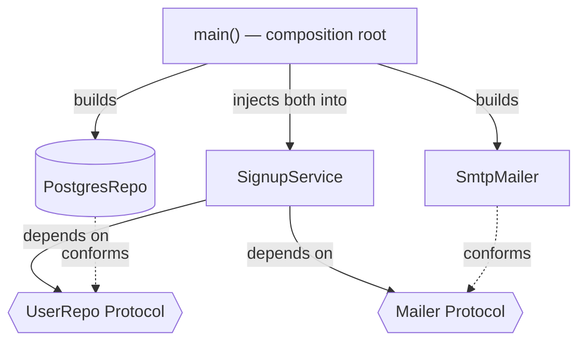

# Module 9: Dependency Injection — Wiring Objects Without Glue Everywhere

## Learning Objectives
- Define DI precisely: **objects receive their collaborators; they don't construct
  them** — and connect it to DIP (Module 5).
- Use `typing.Protocol` as the seam between services and implementations.
- Structure an application around a **composition root** — the single place where
  concrete objects are chosen and wired.
- Swap real implementations for **fakes** in tests without patching.
- Build (and know when to skip) a minimal **DI container** with constructor-signature
  inspection.

---

## 1. The Problem DI Solves

```python
# ✗ hidden, hardcoded dependencies
class SignupService:
    def __init__(self):
        self.db = PostgresUserRepo("prod-dsn")      # constructs its own deps
        self.mailer = SmtpMailer("smtp.corp")       # untestable without a server

# ✓ dependencies injected
class SignupService:
    def __init__(self, repo: UserRepo, mailer: Mailer):
        self.repo, self.mailer = repo, mailer
```

| Hardcoded | Injected |
|-----------|----------|
| Test needs a real DB/SMTP or monkeypatching | Test passes in-memory fakes |
| Swapping impl = editing the class | Swapping impl = editing one wiring line |
| Dependency graph invisible | Constructor signature *is* the documentation |
| Import arrows point at details | Arrows point at Protocols (DIP) |

**Constructor injection** is the default — dependencies are explicit and the object
is valid from birth. Method injection (pass per call) suits per-request values;
attribute injection hides requirements and should be rare.

## 2. Protocols Are the Seam

```python
class UserRepo(Protocol):
    def add(self, user: User) -> None: ...
    def get(self, user_id: str) -> User | None: ...

class Mailer(Protocol):
    def send(self, to: str, subject: str, body: str) -> None: ...
```

The service depends only on these shapes. `InMemoryUserRepo` (tests) and
`PostgresUserRepo` (prod) conform structurally — no shared base class required
(Module 4). Small, per-client protocols keep ISP intact (Module 5).

## 3. The Composition Root

All construction happens in **one place**, at the outermost layer (your `main()`):



```python
def main(env: str):
    if env == "test":
        repo, mailer = InMemoryUserRepo(), FakeMailer()
    else:
        repo, mailer = PostgresUserRepo(dsn), SmtpMailer(host)
    return SignupService(repo, mailer)          # the ONLY place `Signup` is wired
```

> **Pitfall:** scattering construction (`Service()` deep inside handlers) recreates
> the original problem one layer down. If a class needs a dependency *sometimes*,
> inject a **factory** (`Callable[[], Connection]`), not the built object.

## 4. Testing: Fakes Beat Mocks

```python
class FakeMailer:
    def __init__(self): self.outbox = []
    def send(self, to, subject, body): self.outbox.append((to, subject))

def test_signup_sends_welcome():
    mailer = FakeMailer()
    svc = SignupService(InMemoryUserRepo(), mailer)
    svc.signup("ada@example.com")
    assert mailer.outbox == [("ada@example.com", "Welcome!")]
```

A **fake** is a real, simple implementation of the protocol; assertions read as
behavior ("what's in the outbox"), not as interaction choreography
(`mock.assert_called_once_with`). No `unittest.mock.patch`, no import-path
surgery — that's the DI dividend.

## 5. A Minimal Container (and when not to bother)

For big graphs, hand-wiring gets verbose. A container automates it: register a
concrete class per protocol, then **resolve** — the container reads constructor
type hints and recursively builds the tree.

```python
class Container:
    def register(self, protocol, provider, *, singleton=False): ...
    def resolve(self, cls):
        hints = typing.get_type_hints(cls.__init__)   # inspect the constructor
        deps = {name: self.resolve(dep) for name, dep in hints.items()
                if name != "return"}
        return cls(**deps)
```

| Registration kind | Meaning |
|-------------------|---------|
| `register(Proto, Impl)` | build a fresh `Impl` per resolve (*transient*) |
| `register(Proto, Impl, singleton=True)` | build once, share (*singleton scope*) |
| `register(Proto, lambda: Impl(cfg))` | custom factory for awkward constructors |

> **Pitfall:** containers hide wiring errors until `resolve()` runs — you traded
> compile-time visibility for convenience. For an app with < ~10 services, the
> explicit composition root is *better*: readable, greppable, debuggable. Reach for
> a container when the graph, not the pattern, is the pain.

---

## Key Takeaways
- DI = pass collaborators in; constructor injection is the default.
- Depend on Protocols; conform structurally; wire concretions in one composition root.
- Fakes make tests read as behavior, and DI makes fakes trivial to install.
- A container is signature-driven auto-wiring — powerful, but overkill for small graphs.

Next: [Module 10 — Microservice Architecture](../module_10_microservice/README.md).

---

## Files in This Module
- `concepts.py` — the refactor, composition root, fakes, and a working mini-container
- `exercise.py` — build a notification pipeline with DI + your own container
- `solution.py` — reference solution
