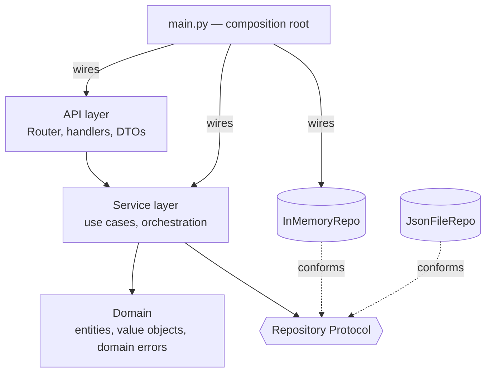

# Module 10: Microservice Architecture — OOP at the System Level

## Learning Objectives
- Structure a service into four layers — **domain, repository, service, API** — and
  state each layer's single responsibility and allowed dependencies.
- Model the domain with **entities** (identity) and **value objects** (immutable
  `@dataclass(frozen=True)`), keeping invariants inside the objects.
- Put persistence behind a **Repository protocol**, with in-memory and file-backed
  implementations that are drop-in swaps.
- Translate domain exceptions into transport-level status codes at the **API
  boundary** — and nowhere else.
- Wire the whole thing in a composition root, proving every prior module earns its
  place in real architecture.

*No frameworks here — pure Python.* The point is the shape; FastAPI/Flask slot into
the API layer later without touching anything beneath it.

---

## 1. The Layered Shape



| Layer | Owns | May import | Never contains |
|-------|------|-----------|----------------|
| **Domain** | entities, value objects, domain exceptions | nothing (stdlib only) | HTTP, SQL, JSON, framework code |
| **Repository** | persistence for one aggregate | domain | business rules |
| **Service** | use cases ("register user", "place order") | domain + repo *protocols* | transport concerns, concrete repos |
| **API** | request parsing, response shaping, status codes | service | business logic |

The **dependency rule**: imports point downward/inward only. The domain knows nothing
about the layers above it — you could lift it into a different app unchanged.

## 2. The Domain: Entities and Value Objects

| | Entity | Value object |
|---|--------|--------------|
| Identity | has an id; equality by **id** | equality by **value** |
| Mutability | state may change | immutable (`frozen=True`) |
| Example | `Order`, `User` | `Money`, `EmailAddress` |

```python
@dataclass(frozen=True)
class Money:                                   # value object: Module 2's eq/hash for free
    amount: int          # cents — never floats for money
    currency: str = "USD"

    def __post_init__(self):
        if self.amount < 0:
            raise ValueError("amount cannot be negative")

    def __add__(self, other: "Money") -> "Money":
        if other.currency != self.currency:
            raise ValueError("currency mismatch")
        return Money(self.amount + other.amount, self.currency)
```

Invariants live **inside** the objects (`__post_init__`, validating setters — Modules
1–3), so an invalid `Money` cannot exist anywhere in the system. Domain errors are a
small exception hierarchy (`DomainError` → `NotFound`, `DuplicateId`, …) — the API
layer maps them; the domain never knows what a 404 is.

## 3. The Repository

```python
class OrderRepo(Protocol):                     # the seam (Modules 4, 5, 9)
    def add(self, order: Order) -> None: ...
    def get(self, order_id: str) -> Order: ...      # raises NotFound
    def list_all(self) -> list[Order]: ...
```

One repository per **aggregate** (a consistency boundary), not per table. The
in-memory version *is* the test double — same contract, so tests exercise real
behavior. A `JsonFileRepo` (or Postgres later) swaps in at the composition root with
zero service edits.

> **Pitfall:** returning live internal objects lets callers mutate stored state
> behind the repo's back. Return copies or immutables at the boundary.

## 4. The Service Layer

One class per cluster of use cases; one public method per use case; collaborators
injected (Module 9):

```python
class OrderService:
    def __init__(self, repo: OrderRepo, ids: IdGenerator, events: EventEmitter):
        ...

    def place_order(self, customer: str, lines: list[tuple[str, int, int]]) -> Order:
        order = Order.create(self._ids.next_id(), customer, lines)   # domain does the math
        self._repo.add(order)
        self._events.emit("order.placed", order.order_id)            # Module 8 observer
        return order
```

The service *orchestrates*; the *domain* calculates. If you find arithmetic or
invariant checks in a service method, push them down into the entity.

## 5. The API Layer

A router maps `(method, path)` → handler; handlers parse the request DTO, call the
service, shape the response, and translate exceptions — the **only** place status
codes exist:

```python
def handle(self, request) -> Response:
    try:
        return handler(request)
    except NotFound as e:        return Response(404, {"error": str(e)})
    except (ValueError, DomainError) as e:  return Response(400, {"error": str(e)})
```

DTOs (plain dicts here) keep domain objects from leaking wire formats: the entity
doesn't grow a `to_json` for every client — the API layer owns that mapping.

## 6. Module-by-Module Payoff

| Module | Where it shows up here |
|--------|------------------------|
| 1 Core | entities with properties, classmethod factories |
| 2 Dunders | `Money.__add__`, frozen dataclass eq/hash |
| 3 Descriptors | validated fields on entities |
| 4 Protocols | `OrderRepo`, `IdGenerator` seams |
| 5 SOLID | the layer table *is* SRP + DIP applied |
| 6 Metaclasses | handler auto-registration |
| 7 Decorators | `@route`, logging middleware |
| 8 Patterns | repository, observer events, factory |
| 9 DI | composition root wires everything |

---

## Key Takeaways
- Four layers, one rule: imports point inward; the domain imports nothing.
- Entities own invariants; value objects are frozen dataclasses; money is integer cents.
- Repositories are protocols per aggregate; the in-memory one doubles as the test fake.
- Services orchestrate injected collaborators; domain objects do the actual math.
- Status codes, DTOs, and serialization live only at the API boundary.

Next: [the Capstone](../capstone/README.md) — build a full service this way, solo.

---

## Files in This Module
- `concepts.py` — a complete four-layer "orders" service in one runnable file
- `exercise.py` — build the same architecture for a URL-shortener service
- `solution.py` — reference solution
